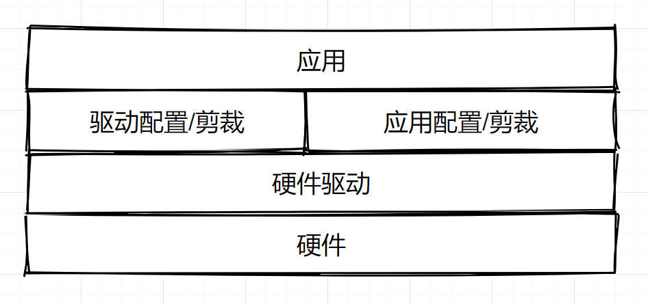
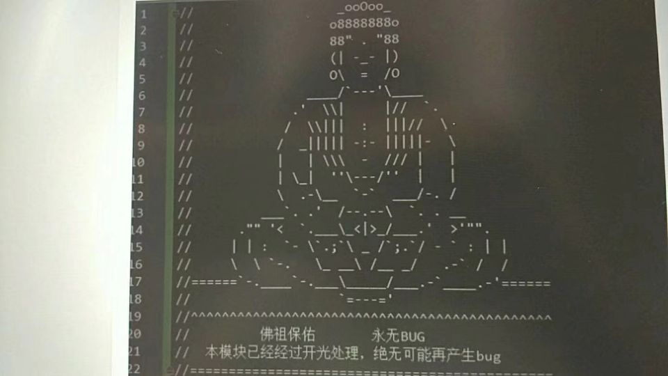

# C & MCU编写规范和其他（coding style and more）

<p align="center">
    
</p>
***p.s 温馨提示：点个 star 收藏一下回头慢慢看；或者下(白)载(嫖)下来，在 Typora 中阅读；或者在  [本文知乎地址](https://zhuanlan.zhihu.com/p/350839857)  阅读。一个人整理不易，此文如此丰富不值忘记 star。***

本文系广泛撷取、借鉴和整理，侵删。本文适合刚入门的人阅读和遵守，也适合已经有较多编程经验的人参看。如有错误恭谢指出！

------

按 1：引用观视频工作室视频[【大师计划·林宝军03】北斗三号总师：我来跟你说说，...](https://www.bilibili.com/video/BV1BA411K7FJ)里面总师受访时所说的话：

5:48：“...所以我经常讲，要把一个产品做好，其实有三方面，一个是**技术**，一个是**质量**，一个是**管理**，这三方面；技术水平，质量保障能力和管理能力，三条腿哪个都少不了，少一个，这个东西（航天）也做不上去，其实技术只是一方面，...”。

6:44：“...光是技术上去了，不见得能做出一个系统。对我们工程来讲，就是（需要）**规范的文化**，什么意思呢，比如我们几十年的航天经验，我把这个经验总结成文字，总结成规范，不管是谁做，只要有一定的经验，按这个规范做出来，做得卫星出来，打到天上去就能好用，这就是规范文化。包括匠人文化和规范文化，最后都是按规矩去做，它强调的是解决了怎么做的问题，但它有一个缺点，没强调为什么，其实我认为在做的过程中，**加个为什么可能更好**。”


按 2：引用 [雷军写代码水平如何？ - 知乎 (zhihu.com)](https://www.zhihu.com/question/23832952/answer/1798476507)。

> 雷总也在给后辈的寄语中不断强调**代码要整洁，逻辑要无懈可击，自己写的代码要达到例程（示范程序）的程度**。这一点和《代码整洁之道》的作者Bob大叔英雄所见略同了。
>
> **Bob大叔就在《代码整洁之道》提出一种观点：代码质量与其整洁度成正比。**
>
> 优秀的系统往往有优秀的结构设计，层次清晰，职责单一，模块化，方便拓展和复用。功能的添加往往只是在现有的框架中添加一个个模块和少量代码。

------

## O 目录

[TOC]

------

## 1 日常素养

- 维护干净整洁的编程环境（保持愉悦的心情，干净整洁的桌面，友好和蔼的同事等等）。
- 身体坐直，按时走走，保证睡眠，计划运动。
- 要学习或使用新东西，全网搜集到好的手册和资料，就已经成功了一半（所谓好的资料不一定是官方教程或手册，可以是别人总结的入门系列文章或视频，适合自己快速摄入的才是好的）。
- 循序渐进，由浅入深。对什么也不感兴趣、不深入是浮躁，而且不经过深入全面的了解就硬扛大型项目也是一种浮躁。
- 习惯去看源代码（熏陶优秀代码风格，有时还能发现新东西）。
- 先搞清楚需求，再构思，再开发，顺序不能错。
- 不要重复造轮子，时常逛开源网站，有新想法可以先去找轮子，也许比自己写的更好，相信前人的智慧和同行们雪亮的眼光。
- 关于调试：
  - 编译错误，如果不明白哪错了，直接无脑复制编译器的错误信息扔到搜索引擎框，然后点“搜索”按钮（大部分报错都是语法错误）。
  - [嵌入式十年调Bug经验总结 - 知乎 (zhihu.com)](https://zhuanlan.zhihu.com/p/451956262)。
- 关于提问，是一门艺术：

  - [谈谈提问的艺术 | How To Ask Questions The Smart Way](https://zhuanlan.zhihu.com/p/133763900)
  - [《提问的艺术：如何快速获得答案》（精读版）](https://blog.csdn.net/ajian005/article/details/81006663)
  - [如何问出一个好问题？| 提问的艺术](https://zhuanlan.zhihu.com/p/95536926)
- 有结对编程，协作开发的能力。
- 有写文档的习惯（对项目写文档，或者日常写博客，或者没事就画一画流程图梳理想法）（不要在技术文章里写“日记”、写“小说”。），条理清晰，简化描述（Keep it stupid simple），并且一定要写上用例，写上例子，写上实例（重要的事情讲三遍）！
- 做好版本管理，有备份的意识（打压缩包写上时间也好，使用git工具也好，放到U盘里也好，传到私人网盘也好）。
- 时常看书，时常看看同行的文章，常读常新。
- 不止技术，不想当将军的士兵不是好士兵（有的人领导能力强，有的人能开发有竞争力的产品，有的人能把知识讲地透彻，有的人理论功底强），时常把视角拉远看一看。

------

## 2 程序框架要点

### 首要地重中之重

- 软件工程结构的分层思想永不灭。

    

- 多任务、复杂流程的整机功能要使用状态机方法来表达、建模和实现。详细内容见 “状态机与层次化状态机” 一节。

- 设计高效、方便的数据存储的数据结构，设计高效、方便的算法来操作这些数据。

- 标准化、通用化和可靠性设计高于功能设计。

在方案设计完之后准备开始实施/实现，不论软硬件，先全网找优秀的实例、原理图、代码、项目、库来参考实现，不要一上来就自己吭哧做。

- [EmbedSummary: 嵌入式大杂烩资源汇总 (gitee.com)](https://gitee.com/zhengnianli/EmbedSummary)。
- [programthink/opensource: 【编程随想】收藏的开源项目清单 (github.com)](https://github.com/programthink/opensource)。
- github 上面的 各种 Awesome 系列 汇总仓库。

### 一些方面的提醒

#### 时间、空间复杂度

时间复杂度表示一个算法内执行语句的数量在最坏的情况下随着循环次数 n 的增加而增长的数量级。一个算法内语句的使用次数（频度）表示为 f(n)，n 为算法内循环语句的循环数，n 的变化直接改变 整个算法的语句使用次数；时间复杂度 O(g(n)) 的定义为，对于一个算法，当且仅当存在正整数 c 和 n0，使得 f(n) ≤ cg(n) 对于所有 n ≥ n0 成立，则该算法的渐进时间复杂度为 f(n) = O(g(n))，g(n) 为 n 的函数。

各个时间复杂度的语句频度的增长速度比较：O(log2n) ＜ O(n) ＜ O(nlog2n) ＜ O(n^2) ＜ O(n^3) ＜ O(2^n) ＜ O(n!)，前三个很好，最后两个不可接受，剩余的强差人意。

程序的执行时间不仅依赖于问题规模，还可能随着数据的状态不同而变化，即其时间复杂度会变化，一般评价算法时候取最坏的情况的时间复杂度。

空间复杂度大同小异。

#### 状态机与分级/并发状态机

可以多用状态机来完成各种任务，大到整个程序的状态、模式控制，小到。

1. 多任务、复杂流程的整机功能要使用状态机方法来表达、建模和实现；益于：思路清楚、维护方便、扩展性好；不用状态机编程比较难得到这几个优点。
2. 设计状态机要根据需求画状态图，再着手实现。要点：关键是画好状态图、不能进入死循环、不能进入非预知状态、穷举所有可能的分支。
3. 在系统的状态划分时，如果细分出的状态特别多，那么要考虑分级状态机或并发状态机（参考书 《基于状态机的嵌入式系统开发》，该书比较老了，思想进行提取）。两种状态机以下分别说。
4. 分级状态机属于上下级划分，而并发状态机属于多个状态机没有从属关系而一同运行（并发不等同于并行）。
5. 这里介绍两种状态机构建模板/方法，一种是  “一个状态对应一个函数” 的模板，另一种是  “switch-case” 方式。前者为作者自实现的，比较易懂好用，其核心代码开源在 "[stm32_framework](https://github.com/Staok/stm32_framework)" 仓库中 F4 里的 `\USER\USER\fsm` 路径内；后者的例子见 `额外文档/fsm-switch-case实现例子.pdf`。

**分级状态机**

1. 系统的顶层状态机一般设计有包括初始化（init）、运行（run）、待机/空闲（standby）和停机（halt）状态等这几个最基本的状态，在每个基本状态下又可细分多个状态组成子层状态机。
2. 在这里，顶层状态机使用 “一个状态对应一个函数” 的模板来实现，子层状态机使用 “switch-case” 来实现。

**并发状态机**

1. 一个系统物理上可以分为若干个同级别的大块，而每一个大块在信号连接上与其他大块之间有少量联系。如果若干是指 10，此时就可以设计 10 个状态机，每个状态机里有若干状态，而某个状态机里的某个状态的转移条件有其他状态机里的事件发生。
2. 意义，比如系统可以划分为 10 个状态机，每个状态机有 3 个状态，如若合成一个状态机，那么将会有 3^10 那么多个系统状态。
3. 多个平级的同时运行的状态机（并发状态机）可以任选用上述两种模板/方法构建。

#### "低耦合，可重用，参数化，注释全"

- 划分好文件、功能函数和所需变量。函数 "低耦合，可重用，参数化，注释全"，变量尽量用结构体打包；可重用意味着直接复制代码或者直接复制文件到另一个项目上直接就用。
- 功能增加裁剪的灵活性：做好预编译设置。方便于切换调试版本和执行版本，方便于切换行为模式，方便于剪裁功能块；功能剪裁用一个名字带"_config"的文件集中管理，供用户修改各种剪裁用的宏定义，就像总控台。
- 参数化设计的适应性：对比如协议解析、模块/功能数量增减、数据范围的变化适应等地方尽量写的通用，通过参数设定来改变运行时/编译时的功能灵活变化。
- 关于 MCU 的编写框架，我目前大抵就认我自己的开源项目 "[stm32_framework](https://github.com/Staok/stm32_framework)" 的吧，规范都对齐这个项目。

#### 嵌入式 C 的一些规范

*p.s 以下为项目 "[stm32_framework](https://github.com/Staok/stm32_framework)" 编写时形成的一些经验和规范，更多具体的还以此项目的源码和架构为准！*

- 本文章 "C 编写规范" 的全部规则都适用。

- 尽量利用硬件资源和外设资源，减少 cpu 负担。

- 系统外设功能的启用与否均用宏定义 SYSTEM_SUPPORT_XX 来管理剪裁。

- RTOS任务函数均使用 os_task_xx_xx() 命名，属于"os_task"。

- 中断优先级分组选用分组4，即16级抢占优先级，不用0级响应优先级。

- IO的低电平为有效电平，高电平截止或者无效；按键IO尽量都使用外部中断。

- 至少用一个定时器提供1ms或者10ms的时基，再用软件分频为 50ms/100ms/300ms/1s 等。

- 外设（Periph）和设备（Devices）分别初始化，外设的启停**成对**编写，命名统一。

- 通讯外设的发送和接收都使用中断，并尽量使用上DMA，以串口为例如下：

    接收：（依时间间隔区分帧为例）

    接收中断->打接收标志位，记当前时间（定时器计数器），比较上次接收的时间，启动DMA->接收缓冲区（足够大，大于2帧）->送解析函数。

    发送：（类 lwip 的发送逻辑，事件驱动）

    要发送的串放入 发送缓冲区，检查发送启动标志位是否就绪，若就绪就打 发送启动标志位->发送中断中，检测发送启动标志位，判断是否发送 发送缓冲区 的串，发完清此标志位，即设为就绪态。

- 等等等等。

#### 嵌入式通讯设计要点

- 通讯尽量使用成熟的协议来封装数据。

    以打包、解包形式进行通讯。鉴于见识有限，协议选择还需要广泛调研和商榷，以下仅为举例

    -   串口通讯协议可以上 Modbus。
    -   CAN 通讯协议可以上 CANOpen。
    -   TCP 通讯协议还有待确定，需要选择一个支持大带宽的。 可以用 json 格式封装数据。

- 如果要自定串口等接口的通信协议，要考虑的点：

    - 数据帧格式规定：

      1. 自定义数据帧（数据打包）的一般格式为：帧头 — 命令/数据类型枚举 — 数据区长度 — 数据区 — 校验区。

         这是一般做法，可以有效避免数据区出现帧头打断接收或解析等等问题；帧头可占一个字节，类型枚举可占两个字节，数据区长度可占四个字节，校验区可占两个字节（可选算法：0xFFFF - 该帧前面的所有字节加和）。

      2. 如果数据区内有多个数据块，每一块可以按照此一般格式合成：该数据块类型枚举（1个字节） — 该数据块数据长度（1或2个字节） — 该数据块的数据。

      3. 一帧有确定的长度；如果按照上面的帧格式，可以没有帧尾，也可以加上；帧头和帧尾必须是确定的，帧头和帧尾的选取尽量避免与数据区重合。

    - 保证一帧尽量连续传输，没有中断；

    - 在有限确定的时间内完成发送；

    - 数据的发送接收相关的函数与数据的打包和解析的相关函数，编写规范上应相互解耦，可重用；

    - 接收完成标志位的置位大抵有两种方式：一个是判断有帧头和等待帧尾来判断为一帧，一个是从接收字节开始计时并在一定时间间隔没有接收数据后判断为一帧。

------

## 3 代码格式化工具列举

*p.s 针对较乱的"祖传代码"做初步治疗使用。代码格式化工具还可以把代码中的 tab 符变成四个空格，这样，当代码在不同的编辑器中打开时不会产生格式错误，所以可以用 AStyle 自己定制一份配置文件，在每次码完代码之后顺手运行一下 AStyle 即可。*

(TODO)下面部分条目尚未补全。

(TODO)查一查astyle配置文件的用法，按照自己的规范形式，写一个配置文件

- 通用工具 AStyle：

  ​	配置文件：  [c-code-style仓库](https://github.com/MaJerle/c-code-style)中的 astyle-code-format.cfg 文件
  ​	AStyle官网：[AStyle官网](http://astyle.sourceforge.net/)
  ​	AStyle is a great piece of software that can help with formatting the code based on input configuration.
  ​	This repository contains `astyle-code-format.cfg` file which can be used with `AStyle` software as command line below.

  ```bash
  astyle --options="astyle-code-format.cfg" "input_path/*.c,*.h" "input_path2/*.c,*.h"
  ```

- VS Code：在 VS Code 中搜索 AStyle 插件 即可。或者 Beautify 插件，代码格式化，都还没试过。

- MDK：关于“把代码中的 tab 符变成四个空格”，在 MDK 的 Edit 的 Configuration 中，把 “Insert spaces for tab” 都勾上即可。

- IAR：

- Eclipse：

  ​	配置文件：  [c-code-style仓库](https://github.com/MaJerle/c-code-style)中的 eclipse-ext-kr-format.xml
  ​	Repository contains `eclipse-ext-kr-format.xml` file that can be used with eclipse-based toolchains to set formatter options.
  ​	It is based on K&R formatter with modifications to respect above rules.
  ​	You can import it within eclipse settings, `Preferences -> LANGUAGE -> Code Style -> Formatter` tab.

- Source Insight：

- Notepad：关于“把代码中的 tab 符变成四个空格”，在 Notepad 的 设置 的 语言 中，把制表符框的 “替换为空格” 勾上即可。


一些网友开源项目：

- [mysterywolf/formatting: 源码格式自动化调整工具 (github.com)](https://github.com/mysterywolf/formatting)。
- 【】。

------

## IT 学习路线

1. C语言基础（看书、B站等均可） →
2. C语言三剑客：《C和指针》、《C陷阱与缺陷》和《C专家编程》，经典永流传 →
3. 数据结构与算法（线性表/树/图/哈希 + 排序/搜索/规划等等等 按需学） →
4. 计算机专业学科看。《计算机组成原理》/《计算机体系结构》；《计算机操作系统》/《现代操作系统》/《深入理解计算机系统》；可选《编译原理》、《深入分析GCC》；网络协议如《计算机网络》、《TCP-IP详解卷一/卷二/卷三》等 →
5. 可选 《CPU自制入门》 →
6. 走向：嵌入式 Linux 方向、FPGA / 芯片设计 / 验证方向、具体某算法方向（如 CV、ML、DL）等等。

更多可详细参考 [rd2coding/Road2Coding: 编程之路 (github.com)](https://github.com/rd2coding/Road2Coding) 的总结，比较全面了。

## 相关坚韧大厚书

没给出链接的 网搜名字即可。

- [哪本《数据结构与算法》最好？ - 知乎 (zhihu.com)](https://www.zhihu.com/question/21628833) 该回答列举了一些不错的数据结构与算法方面的书籍。
- 《算法导论》（经典）是计算机学科的算法入门书。
- 《计算机体系结构》（经典），《计算机操作系统》/《现代操作系统》/《深入理解计算机系统》。
- 《编码的奥秘》，相关介绍/推荐 [想练习《编码的奥秘》里面的知识，有什么软件有帮助？ - 知乎 (zhihu.com)](https://www.zhihu.com/question/28223767)。《编译原理》（经典），《深入分析GCC》。
- 网络协议如《计算机网络》、《TCP-IP详解卷一/卷二/卷三》，[ 想深入了解 HTTP 协议，有哪些值得推荐的书籍？ - 知乎 (zhihu.com)](https://www.zhihu.com/question/19722062)。
- 嵌入式应用相关：《GNU Make》，《Debugging with GDB》，《Linux 高级程序开发》，《POSIX 多线程程序设计》，《嵌入式Linux基础教程》，《嵌入式Linxu应用开发完全手册》，《嵌入式Linxu应用程序开发详解》。
- 嵌入式底层相关：内核相关：《深入理解Linux内核》，《Linux内核源代码情景分析》，《Linux内核设计与实现》；驱动相关：《Linux设备驱动程序》，《Linux设备驱动开发详解》，《Linux驱动开发入门与实践》。

## 相关有趣/耐看书或视频

- ~~[《算法新解》开源书](https://github.com/liuxinyu95/AlgoXY)。~~《啊哈！算法》。
- 图解系统 小林。图解网络 小林。
- [趣谈网络协议](https://book.douban.com/subject/35013753/)。
- 手绘图解HTTP。30张图解HTTP常见面试题。
- [TCP/IP 教程 | 菜鸟教程 (runoob.com)](https://www.runoob.com/tcpip/tcpip-tutorial.html)。[HTTP 教程 | 菜鸟教程 (runoob.com)](https://www.runoob.com/http/http-tutorial.html)。
- [《嵌入式C语言的自我修养》](https://book.douban.com/subject/35446929/) 从沙子讲到CPU，从编辑器讲到编译器，从高阶C语言讲到内存管理，从GNU讲到多任务编程。


- [（完结）（小甲鱼）数据结构和算法_ 哔哩哔哩 _bilibili](https://www.bilibili.com/video/BV1os41117Fs)。
- [国嵌唐老师主讲【数据结构与算法C语言】（非常犀利）_ 哔哩哔哩 _bilibili](https://www.bilibili.com/video/BV1eK4y1J7zh) 讲的慢。

------

## 4 普适规则（General rules）

*p.s 以下所有章节中示例代码均以 32 / 64 位机为运行环境，即 int 占 4 字节。*

1. 第一条，请您重视编写规范！可以有代码洁癖。

2. 使用 C99 标准（某些仅支持 C98 的 IDE 除外）。

3. 一个 tab 四个空格（对于 Vscode、Notepad、Eclipse、Vim 和 MDK/Keil、IAR 等编辑器，都应该设置按一下 tab 为输入四个空格，这样文本样式在不同编辑器里打开尽量不会乱）。

4. 运算符前后空一格，给函数传递的多个变量之间在逗号后空一格，一元操作符后不要加空格，例子如下。

   ```c
   for(i = 0 , tempNum += 3; i < 6; ++i)    /* i，永远滴神 */ /* for(i = 0; i < 6; ++i) 这么写是循环 6 次，可以记住 */
       tempNum = tempNum + 3,
       tempNum += 3;
   int32_t tempNum = sys_example_sum(4, 3);
   sys_example_func(&time_data_struct, !(++is_time_show));
   ```

6. 注释里，字母和数字的两边空一格，尽量用`/* ……… */`注释，而非`//...`，例子如下。对于注释遵循 Doxygen（详见`关于注释的形式（Comments）`一节） 等规则的除外。

   ```c
   /* 用 3 这个数字代替洋文 three 了解了吗 */
   ```

6. 关于命名。

   - 文件统一采用小写命名。

   - 变量和函数的命名都只用小写（尽量），宏定义使用全大写（尽量），并遵循 "属什么 _ 是什么 _ 做什么" 的命名形式，如：sys_irq_disable()，该 API 属于 sys 级别函数，是 irq 管理，做 dsiable 的功能。不要用晦涩的英文缩写甚至拼音就不用讲了吧。

   - 具有互斥意义的变量或者动作相反的函数应该是用互斥词组命名，例子如下。  

     > add/remove      begin/end             create/destroy               insert/delete
     > first/last            get/release            increment/decrement    put/get add/delete
     > lock/unlock      open/close             min/max                        old/new
     > start/stop         next/previous         source/target                 show/hide
     > send/receive   source/destination  copy/paste                    up/down

   - 不要使用单字节命名变量，但是允许使用 i， j， k 这样的作为局部循环变量。

   - 关于函数、变量、宏定义等的命名看 `5 具体各部分的规范形式`章节。

7. 控制语句总加括号（即使分支执行语句只有一句），成对的括号要在竖方向上对齐，用 tab 把层次分地清清楚楚，例子如下（为了节省空间，下面示例用横向写~）。

   ```c
   if( )             for (i = 0; i < 6; ++i)    do                switch (check()) 
   {                 {                          {                 {
                                                                         case 0:
   }else if( )       }                          }while( );                   fsm_do_a();
   {                                                                         break;
                                                                         case 1:
   }else                                                                     fsm_do_b();
   {                                                                         break;
                                                                         default:
   }                                                                         break;
                                                                   }
   ```

   - 对于多个条件的 “与”、“或” 等操作，应该将每一个条件都用括号括起来，层次分明，如：`if ( ( (c == ' ') || (c== '\n') ) && (b == '\t') ){;}`。
   - 分支控制语句要写明所有分支情况，每一个条件都有明确的去向，对于 if 必带 else，对于 switch 必带 default，诸如此类。

8. 无限循环尽量用 `for(;;)` 替代 `while(1)` 等；条件循环语句用后者。

9. 层次分明，多用 tab 划分层次关系（预编译部分代码也不例外），例子如下。

   ```c
   #ifdef _DEBUG
       #define DEBUGMSG(msg,date) printf(msg);printf(“%d%d%d”,date,_LINE_,_FILE_)
   #else
       #define DEBUGMSG(msg,date)
   #endif
   ```

10. 长运算语句尽量多的用括号（每一步运算都用括号括起来），并做好空格增加可读性，例子如下。

    ```c
    temp = ( 0x7F << ((xByte - 1) * 8) );
    #define MAX( x, y ) ( ((x) > (y)) ? (x) : (y) )
    ```

11. 用 `if (check_func()) { ... }` 代替 `if (check_func() == 1)`，判断是否为 '0' 可以用后者的写法（即`check_func() == 0 或 NULL`，或者用 `!check_func()`），判断 '1' 用前者写法。

12. 判断指针是否为空只用 "NULL"，即 `void *ptr0, *ptr1; if ( (ptr0 == NULL) || (ptr1 != NULL) ) { ... }`。

13. 不用变长数组，用内存分配释放函数 `malloc()` 和 `free()`。

14. 大块内存请使用内存管理。

15. 尽量减少数据传输过程中的拷贝，对于全局变量的字符串、数组和结构体等，采用传递指针的方式。

16. 文件操作中 open  和 close 成对使用，内存管理 malloc 和 free 成对使用。

18. 关于源文件、头文件和变量作用域等。[头文件里的大学问，C语言需要注意这些原则... (qq.com)](https://mp.weixin.qq.com/s/UxPdi4-07jonPsJgeSfWow)。

    - 变量、API 的作用域要明确：定义时带有 static 修饰符的变量（无论是声明在在某个函数里还是函数外）是 只在该文件具有作用域的，其他文件不能够访问到。一个文件的变量声明都放在 .h 里面，公有变量声明时 加 extern 修饰符 以供其他文件调用，私有变量声明时不加 extern 修饰符。明确好所有变量和函数在工程中的调用范围，由此来控制其作用域的 缩小 / 尽量最小化，减少不必要的 调用 / 引用，对编译时间和管理都有好处。
    - 非必要的不引用：在 .c 文件中 include 自己对应的 .h 文件和需要用到的 .h 文件，不要引用多余的 .h 文件；.h 文件中同样只引用用到的头文件；头文件尽量写成无依赖的；尽量减少依赖，这就考验整个系统的规划和设计。
    - 不一定 一个 .h 文件对应 一个 .c 文件：如果 一个模块 包含了多个 .c 源文件来实现，那么将它们放入同一个文件夹并用模块名命名，然后只用一个 .h 头文件声明 该模块的 接口。
    - 关于开源协议:Every file (header or source) must include license (opening comment includes single asterisk as this must be ignored by doxygen). Use the same license as already used by project/library.
    - 对于 .h 文件，其基本格式如下。每一个文件在最后留有至少一个空行。


```c
#ifndef TEMPLATE_H
#define TEMPLATE_H

#include <stdint.h>
#include "all_other_custom_file.h"

/* 当 C 和 C++ 代码混合编译的时候，在下面两个 __cplusplus 标识的中间放 C 部分的声明代码 */
#ifdef __cplusplus
	extern "C" 
	{
#endif /* __cplusplus */

/* C 部分的声明代码 */

#ifdef __cplusplus
	}
#endif /* __cplusplus */

#endif /* TEMPLATE_H */

/* 文件结尾至少留有空行 */

```

19. 理论上讲，任何递归算法都可以通过循环等方法实现，尽量不用递归，不好查阅和容易栈溢出。

    更多网友总结的杂类细节规范、规则：

    - [学C/C++语言，32个必备修养！ (qq.com)](https://mp.weixin.qq.com/s/auLsbmr7SKgoO05HykXpzQ)。
    - 
    - etc...

------

## 5 具体各部分的规范形式

### 关于函数定义形式（Functions）

- 小写；星号 * 靠近类型名一端；用" _ "分割语义；对齐以保持良好阅读性。

- 命名遵循 `属什么 _ 是什么 _ 做什么` 的形式，例子如下。

  ```c
  void            sys_example_init(void);
  const char*     sys_string_generater(void);
  my_struct_t*    sys_example_hello(int32_t para1, int32_t para2);
  void            fsm_state_set(int32_t fsm_ID);
  my_type_t       fsm_state_get(void);
  my_ptr_t*       menu_get_current_ptr(void);
  ```

- 函数的局部变量数量最好不超过 5 - 10 个，即不要占用太多的内存/栈资源。

- 一个函数尽量只做一件事，否则划分为多个更小的函数；不要重复，保持各个代码块的独特性。

- **低耦合，可重用，参数化，注释全！**

- 对函数的错误返回要做全面的处理；一般 返回 0 表示 正确 或 运行正常终止，返回其他表示错误，具体的值表示错误代号，可用定义了所有错误类型的枚举变量作为函数返回值类型，或者返回值 0 表示成功，正数表示失败，此正数可以表示错误代码；并设计专门的机制对错误标识做处理。

- 对函数的参数做合法性检查；检查指针；检查变量范围，变量有大小限制的，在注释里写明；在其他地方调用此变量的时候要进行检查或限幅，例子如下。

  ```c
  /* 幅值系数，范围 0~1 */
  float wave_point_A = 0.8;
  
  /* 检查：*/
  if( wave_point_A > 1 ) wave_point_A = 1.0f;
  if( wave_point_A < 0 ) wave_point_A = 0;
  
  /* 限幅：*/
  wave_point_A > 1 ? 1.0f : wave_point_A;
  wave_point_A < 0 ? 0    : wave_point_A;
  ```

- 如果函数传入参数（形参）的数量过多（超过 5 个），那么要考虑精简或者用其他办法，即可以将参数打包为全局的 数组 或 结构体 等 然后传递其指针；对于返回多个值同理；字符串指针 和 结构体指针 等在定义时若未初始化，则使用前要用 malloc() 为其申请空间。

- 对于函数可能传入的参数是不定的任意类型，定义形参用 `void*` 修饰。函数明确 没有/不能 传入/返回 参数时要在形参处用 `void` 指明，如上面的`void            sys_example_init(void);`。

- 函数的嵌套不要过多，一般控制在最多 4 层。不要用递归这种反阅读便利的写法（并且控制不好易栈溢出），用循环语句实现。

- 关于 指针函数 和 函数指针。

  指针函数即指 返回值带指针变量的函数，使用情景参看上面。

  函数指针即指 函数类型的指针，定义的形式和使用情景如下，函数指针名加后缀 "_ fn"，函数指针类型定义名再追加后缀 "_ t"。

  ```c
  /* 函数指针定义写法和用法举例 */
          unsigned char (*sys_print_compile_time_fn)(unsigned char);
  typedef unsigned char (*sys_print_compile_time_fn_t)(unsigned char);
  
  unsigned char print_compile_time(unsigned char is_print)
  {
      if(is_print)
      {
          printf("%s\n",__TIME__);
          return 0;
      }
      return 1;
  }
  unsigned char print_compile_date(unsigned char is_print)
  {
      if(is_print)
      {
          printf("%s\n",__DATE__);
          return 0;
      }
      return 1;
  }
  
  int main()
  {
      /* 用法1，给函数指针赋值 */
      sys_print_compile_time_fn = print_compile_time;
      
      /* 用法2，定义一个函数指针变量，并赋值 */
      sys_print_compile_time_fn_t print_compile_time_fn;
      print_compile_time_fn = print_compile_time;
      
      /* 调用 */
      (*sys_print_compile_time_fn)(1);
      (*print_compile_time_fn)(1);
      /* 改变函数指针指向的函数，再调用 */
      print_compile_time_fn = print_compile_date;
      (*print_compile_time_fn)(1);
  }
  
  /* 再举一个例子，引自《C程序设计语言》 */
  /* 一些声明 */
  char *lineptr[500];
  int numcmp0(char *, char *); /* API 声明时形参可以不带变量名 */
  int strcmp0(char* stri1,char* str2);
  void qsort(void *lineptr[], int left, int right, int (*comp)(void *, void *))
  {
      ...
      if ((*comp)(v[i], v[left]) < 0) {...}
      ...
  }
  
  /* 调用，三段式写法来选择传入哪个API */
  qsort((void**) lineptr, 0, nlines-1, (int (*)(void*,void*))(numeric ? numcmp : strcmp));
  ```
  

### 关于变量定义形式（Variables）

- 小写，对齐以保持良好阅读性。

- 同类型的变量声明放在一行，变量定义时避免用函数返回值。

- 命名中 用下划线 `_` 分割语义，命名遵循 "**属什么 _ 是什么 _ 做什么**" 的形式，要意义明确。命名开头以两个下划线或一个下划线的约定俗成保留给系统，因此普通应用中应避免。

- 避免使用 stdbool.h 里的 "true" 或 "false"，用 "1" 或 "0" 代替。

- 变量类型，除了char* 、float 和 double，都使用 stdint.h 库（对于不同位数的机器，使用这个文件里面的类型定义，可以明确每个类型的长度）里面的，统一起来。整文件或整工程中变量定义处的变量关键字修改，可以用 批量替换 来完成，如 统一的将 `INT8` 修改为 `char`。

  ```c
  /* 定义一些常用的数据类型短关键字，为兼容性附加，可选 */
  typedef int32_t  s32;
  typedef int16_t s16;
  typedef int8_t  s8;
  
  typedef uint32_t  u32;
  typedef uint16_t u16;
  typedef uint8_t  u8;
  
  typedef const int32_t sc32;  
  typedef const int16_t sc16;  
  typedef const int8_t sc8;  
  
  typedef const uint32_t uc32;  
  typedef const uint16_t uc16;  
  typedef const uint8_t uc8; 
  /* 以上 12 个的左边的关键字 来自 对于 32 位机的 stdint.h */
  
  /* 以下定义要随着平台的切换而有可能切换，
      比如 8 位机的 8051 MCU 中 int 为两个字节，
      32 位机（如 STM32）中 int 为四个字节，
      64 位机同 32 位机 */
  /* 这里针对的是 32位/64位 机器而言，即 int/float 为 4 字节 */
  typedef unsigned char	        uint8;  /*  8 bits */
  typedef unsigned short int		uint16; /* 16 bits */
  typedef unsigned int		    uint32; /* 32 bits ,long int 也为 32 bits*/
  
  typedef signed char				int8;   /*  8 bits */
  typedef short int	        	int16;  /* 16 bits */
  typedef int		        		int32;  /* 32 bits */
  
  typedef volatile int8			vint8;  /*  8 bits */
  typedef volatile int16			vint16; /* 16 bits */
  typedef volatile int32			vint32; /* 32 bits */
  
  typedef volatile uint8			vuint8;  /*  8 bits */
  typedef volatile uint16			vuint16; /* 16 bits */
  typedef volatile uint32			vuint32; /* 32 bits */
  
  typedef float   				float32; /*  32 bits */
  typedef double   				float64; /*  64 bits */
  
  typedef unsigned char   		 boolean; /* 8-bit*/
  ```

- 合理的常用 const 修饰符，防止变量或指针在层层传递过程中被篡改，或者在定义的时候永远加上 const 修饰符，例子如下。

  ```c
  const unsigned char xByte;      /* xByte 的内容不能变 */
  const char *p; char const *p;   /* 二者一样，都是 p 所指向的内容不能变 */
  char* const p;                  /* const 修饰的是 p ， p 不能修改，即地址不能修改，其指向的内容可以修改 */
  const void* const p;            /* p 所指向的内容和 p 地址本身都不能改变 */
  /*
  p.s    char* c 与 char *c 没有任何区别
         signed int 和 unsigned int 区别很大，前者是可以表达正负数的源码，后者是从 0 开始的正数或是一串参与逻辑运算的二进制
  */
  ```

- 为防止编译器优化程序中一些关键/重要的变量的给值顺序等，可在变量定义时加 volatile 声明，即不要优化掉这里。

- 对于函数内的局部变量，不希望在函数跳出后局部变量数据丢失那么加上 static 修饰符（指示该变量具有所在文件作用域），static 修饰符的变量若定义在一个文件内当作 “全局变量”，其是 只在该文件具有作用域的，其他文件不能够访问到。

- 玩一下，比较极端的情况，一个完整的变量声明形式：`extern static volatile const unsigned long int* const temp_reg[sizeof(int)];`。

- 变量如果是低有效，变量名加尾缀"_n"，比如使能 en 是低有效（en 上面有一横），则命名为 "en_n"。

- 明确全局变量的初始化顺序，系统启动阶段，使用全局变量前，要考虑到全局变量该在什么地方初始化，使用全局变量和初始化全局变量之间的时序关系一定要分析清楚。

- 明确变量的作用域，防止在预想的作用域外能够调用到具体的某个变量，降低模块间耦合度。

- 尽量减少不必要的数据类型转换，即 “类型强转”。关于 “类型强转”，要先看位数，低位数类型可以向高位数类型强转，而这个过程反过来的时候，高位数类型直接转换为低位数类型则高位会被丢弃，因此对于高位数类型的数值应该先取低八位/十六位/三十二位等，再强转，这样是比较安全和方便阅读。

- 关于指针相关灵活用法更多详见`实用技巧`一节里的 指针专题 部分。

### 关于结构体、枚举和类型定义形式（Structures, enumerations, typedefs）

- 适用 "关于变量定义形式（Variables）"里面的内容。

- 枚举定义形式有直接定义、类型定义、指针和数组等，枚举内可以嵌套定义结构体，结构体内也可以嵌套定义枚举。

- 结构体和枚举可以用 typedef 修饰。

- 结构体里的成员小写，枚举里的所有成员大写。

- 结构体应尽量不作为函数的形参或返回值等，而是用其指针替代，减少数据拷贝。

- 结构体定义后加“_ struct”尾缀，对于类型定义后再追加 "_ t"，例子如下。

  ```c
  /************************* 枚举定义 *************************/
  enum errType_enum
  {
      RETURN_OK = 0,
      RETURN_ERR_1,
      RETURN_ERR_2,
      RETURN_LAST /* 值为 3，同时也是所在枚举定义的枚举数量 */
  };
  
  typedef enum
  {
      MY_ENUM_OK = 0,
      MY_ENUM_TESTA,
      MY_ENUM_TESTB,
      MY_ENUM_LAST
  }my_enum_t;
  
  /* 两种枚举使用，一个作为形参，一个作为返回值 */
  enum errType_enum sys_process_hello(my_enum_t my_para);
  
  /************************* 结构体定义 *************************/
  struct simple_struct      struct /* 只用一次的结构体 */        typedef struct
  {                         {                                  {
      int a;                        int a;                            int a;
      char b;                       char b;                           char b;
      double c;                     double c;                         double c;
  }simple, *simple_p;       }abc;                              }simple_struct_t;
  
  /* 使用 sizeof() 获取结构体大小（字节为单位），而实际存储占用长度会因字节对齐而不确定 */
  
  struct simple_struct simple, *simple0_p = &simple0; /* 定义结构体变量和其指针一对，并给指针赋值 */
  simple0_p->a = simple0.b;                           /* 取值，赋值 */
  struct simple_struct simple1[10] =                  /* 结构体数组定义，并赋值 */
  {
      {1, 2, 3},
      {3, 2, 1},
      ...
  };
  
  /************************* 位段 *************************/
  /* 结构体内还可以对成员声明位段（有的地方也叫 位域），即声明每个成员占用的 bit 数。不多见 */
  /* 成员必须为无符号整型 */
  struct mybitfields
  {
  	unsigned short a   :4;
  	unsigned short b   :5;
  	unsigned short c   :7;
  }test;
  
  /* 幅值 */
  test.a = 2;
  test.b = 31;
  test.c = 0;
  
  /* 赋值后 的实际情形
  16bit 的实际值：        00000001 11110010
  16bit 的 abc 占用位置： cccccccb bbbbaaaa
  */
  
  struct date_struct {
  	unsigned char day :5;
  	unsigned char month :4;
  	unsigned short year :14;
  }date;
  /*
  0 | 0 0 0 0 0 0 0 0 0 0 0 0 0 0 | 0 0 0 0 |  0 0 0 0 0 |
    +--------- year --------------+- month -+---- day ---+
  */
  ```

- 结构体的实例化尽量用 "表格" 形式，并在每列头部写好注释，例子如下。

  ```c
  struct fsm_states_struct fsm_XXX1_state[XXX1_State_MAX] = 	/*定义描述名为‘fsm_XXX1’的状态机的状态图*/
  {                                                 	      /*跳转条件都初始化为0*/
      /*               状态               执行函数         跳转条件数量     各个条件跳转后的状态（注：根据跳转条件的优先级从高到低往下写）*/
      {(unsigned int)XXX1_State_1,   fsm_XXX1_state_1_Fun,    2,{     {0,(unsigned int)XXX1_State_5    },
                                                                      {0,(unsigned int)XXX1_State_2    },    }},
  
      {(unsigned int)XXX1_State_4,   fsm_XXX1_state_4_Fun,    1,{     {0,(unsigned int)XXX1_State_5    },    }},
  };
  /* 或者 */
  simple_struct_t simple = 
  {
      .a = 65530,
      .b = 125,
      .c = 1.0
  };
  ```

### 关于联合和其类型的定义形式（union）

- 联合的长度为其中最大一个变量/数组的长度，定义形式同样有直接定义、类型定义、指针和数组等，联合内可以嵌套定义结构体，结构体内也可以嵌套定义联合；定义枚举类型要加 “_union” 尾缀，其它尾缀依上面所说类推。

- 联合应尽量不作为函数的形参或返回值等，而是用其指针替代，减少数据拷贝。

- 联合的定义和应用情景举例如下。

  ```c
  /************************* 一、四字节整形可以直接取每一个字节 *************************/
  /* 举例 1 */
  union simple_union
  {
      int var_int;
      char var_char[4];
  }
  
  union simple_union four_bits.var_int = 0xaabbccdd;
  /* 即 var_char[0] 为 0xaa，var_char[1] 为 0xbb，以此类推  */
  
  /* 举例 2 */
  union
  {
  	int i; /* 占四字节 */
  	struct /*在联合中定义一个结构*/
  	{
  		char first;
  		char second;
  	}half; /* 占俩字节 */
  }number;
  
  number.i = 0x44434241; /*联合成员赋值*/
  /* number.i 的低俩字节给了 half 结构体，即 number.half.first 为 0x42，以此类推  */
  
  /* 通过上面两个举例可以看出，在字节 拼接 和 检出 时使用 联合 非常方便 */
  
  /************************* 二、两个 程序/线程 要以不同的最小单位访问同一块内存 *************************/
  typedef struct{
      int ram_full_flag;
      int ram_store_flag;
      int ad_channels_en;
      union{
        char ram_store_data[8][512];
        u16  ram_send_data[8][256];
      }_ram;
  }_RAM_FORMAT;
  _RAM_FORMAT RAM_Format;
  /* 
  可以看出 结构体里面的枚举，同一块区域内分别以 8 位和 16 位划分，
  以 8 位为最小单位接收，以 16 位为最小单位发送
  */
  
  /************************* 三、联合 和 结构体 + 位域 结合，可以访问一个字节的每一个 bit *************************/
  typedef union
  {
      char Val;
      struct __packed /* __packed 修饰，结构体字节对齐 */
      {
          char b0:1;
          char b1:1;
          char b2:1;
          char b3:1;
          char b4:1;
          char b5:1;
          char b6:1;
          char b7:1;
      } bits;
  }BYTE_VAL, BYTE_BITS;
  ```


### 关于宏定义和预编译指令定义形式（Macros and preprocessor directives）

- 宏定义使用全大写（尽量），并遵循 "属什么 _ 是什么 _ 做什么" 的命名形式。

- 尽量把常数数字用宏定义代替；常量建议使用 const 定义来代替宏；前面这两句话实际是矛盾的，因地制宜吧，优化速度用前者，优化空间用后者。

- 对宏定义中的所有输入和输出（整个结果语句）用括号保护起来，举例如下，长句用 `do{...}while(0)`。

  ```c
  #define MY_MACRO(x)         ((x) * (x))
  #define MIN(x, y)           ((x) < (y) ? (x) : (y))
  
  #define SET_POINT(p, x, y)  do{ (p)->px = (x); (p)->py = (y); }while(0)
  /*或者下句更好：*/
  #define SET_POINT(p, x, y)  do{        \   /* Backslash indicates statement continues in new line */
          (p)->px = (x);                 \
          (p)->py = (y);                 \
      }while(0)                             /* 2 statements. No semicolon after while loop */
  ```

- 预编译指令语句使用 tab 标识好层次，举例如下。

  ```c
  #if defined(XYZ)
      /* Do when XYZ defined */
      #if defined(ABC)
          /* do when ABC defined */
      #endif
  #else
      /* Do when XYZ not defined */
  #endif
  ```

### 关于注释的形式（Comments）

1. 注释里**尽量写为什么**，而不是把重点放在做了什么，虽然后者也很重要。

2. 尽量使用 Doxygen 的注释语法，然后可以使用 Doxygen 这个软件从源码工程的注释中自动化生成软件工程的说明文档，注释写的全（包括文件和API等的描述等等）那么生成的文档也会很全。Documented code allows doxygen to parse and general html/pdf/latex output, thus it is very important to do it properly。目测目前我见过的用源文件产生手册的大型项目有：LWIP、FreeRTOS、ST HAL、CMSIS等，关于 ST HAL 库里面的注释形式的详细情况请看 “8 ST HAL 的编写形式” 章节！

   - Doxygen 的注释语法规范。网上很多，这里列举几个：

     - [Doxygen 注释语法规范 - 黄树超 - 博客园 (cnblogs.com)](https://www.cnblogs.com/schips/p/12200388.html)。
     - [C语言中的Doxygen注释模板_胡图图-CSDN博客_c语言函数注释模板](https://blog.csdn.net/u013178472/article/details/107164902)。

     需要注意的是，Doxygen 并不处理所有的注释，其重点关注与程序结构有关的注释，比如：文件、类、结构、函数、全局变量、宏等注释，而忽略函数内局部变量、代码等的注释。先从文件开始注释，然后是所在文件的全局函数、结构体、枚举变量、命名空间→命名空间中的类→成员函数和成员变量。

   - 使用 Doxygen 生成文档的教程（这几个教程里面也包含有 Doxygen 的语法介绍）：

     - [Doxygen给C程序生成注释文档 - on_the_road - 博客园 (cnblogs.com)](https://www.cnblogs.com/fkpj/p/4537145.html)。
     - [Doxygen生成注释文档_destiny的专栏-CSDN博客_doxygen生成文档](https://blog.csdn.net/tuwenqi2013/article/details/70050849)。
     - [代码注释规范之Doxygen - silencehuan - 博客园 (cnblogs.com)](https://www.cnblogs.com/silencehuan/p/11169084.html)。

   - Vs Code 的 Doxygen 格式注释生成插件：

     - [Doxygen Documentation Generator - Visual Studio Marketplace](https://marketplace.visualstudio.com/items?itemName=cschlosser.doxdocgen)，用这个，官方比较全。或者在 VScode 扩展里 安装 C/C++ Extension Pack，里面包含了许多 C/C++ 实用扩展，包括 Doxygen Documentation Generator。
     - [Vs code自动生成Doxygen格式注释_wang0huan的博客-CSDN博客](https://blog.csdn.net/wang0huan/article/details/103107472/)。
     
     *p.s 关于 Doxygen 文档的更多具体写法用时再详看进行手写，或者使用生成插件*

3. 下面列举几种花哨的，其中有我自己“创造”的。函数定义的注释，主任务函数的注释，用于显眼！

   ```c
   /*__________函数简述_____________*/
   /********************************
   * 描述：函数详细描述
   * 参数：   1、第一个形参名 描述
             2、第二个形参名 描述
   		 ...
   * 返回：  返回值类型    描述
   ********************************/
   
   /*____________运行错误提示和打印______________________________*/
   /************************************************************
   * 描述：表示某步骤运行有问题，串口提示，灯提示，声提示
   * 参数：   1、errmsg    错误或者警告信息
             2、errid     故障代号
             3、err_flag  错误类别（可选flag_Fault或flag_Warning）
   * 返回：   NULL
   ************************************************************/
   
   /*************\
   * Multi-line  *
   * comment     *
   \*************/
   
                                       /*************\
   *************************************  Multi-line *****************************************************
                                       *   comment   *
                                       \*************/
   
   /*______________________\\\                               ///__________________________*
   *___________________________________外设初始化函数_______________________________________*
   *_______________________///                               \\\__________________________*/
   ```

   文件说明注释：

   ```c
   /*************************************************
                开头这里放开源协议的描述源文
   Copyright © xxx Co., Ltd. 1998-2018. All rights reserved.
   File name:   文件名
   Author：     作者
   Version:     版本号
   Description: 用于详细说明此程序文件完成的主要功能，与其他模块
   或函数的接口，输出值、取值范围、含义及参数间的控制、顺序、独立或依赖等关系
   Others:      其它内容的说明
   Log:         修改日志，包括修改内容，日期，修改人等
   *************************************************/
   
   
   // Doxygen 格式
   /**
    * @file main.c
    * @author your name (you@domain.com)
    * @version 0.1
    * @date 2021-06-30
    * @license GNU General Public License (GPL)  
    * @brief 
    * @attention
    * 
    */
   ```

4. 程序文件开头的版权信息写法列举：

   > 引用自[软件中声明版权的写法-专业指导文档类资源-CSDN下载](https://download.csdn.net/download/UltraCoder/841110)，侵删。
   >
   > 正确的格式应该是：Copyright [dates] by [author/owner] 
   >
   > © 通常可以代替Copyright, 但是不可以用(c)。 All Rights Reserved 在某些国家曾经是必须的，但是现在在大多数国家，都不是法律上必须有的字样。 
   >
   > 参见下面几个正确的格式： 
   >
   > - ©1995-2004 Macromedia, Inc. All rights reserved. 
   >
   > - ©2004 Microsoft Corporation. All rights reserved. 
   >
   > - Copyright © 2004 Adobe Systems Incorporated. All rights reserved. 
   >
   > - ©1995-2004 Eric A. and Kathryn S. Meyer. All Rights Reserved. 
   >
   >
   > 请注意标点符号和大小写的用法，这也是专业精神的一种体现。 
   >
   > 现在流行some rights reserved：creativecommons.org 
   >
   > some rights reserved 和copyright 本身并不矛盾，但是其中的界限更多是一个道德问题，真正的保留一部分权力，是指给浏览者fair use 的权利，fair use的界定也决不是随便乱用，或者抄袭。 
   >
   > 甚至说，除了copyright, 还有copyleft,它的定义是为了程序员开发能够共享源代码的一个方式，英文里free, 并不仅仅是免费。 而且这种的源码公开免费使用，和版权也一点都不冲突。请大家不要误解。

### 其他常用写法汇集（不定期更新）

将一些常用的并且技巧性、灵活性较高的或者少见的写法进行罗列。

#### 实用技巧

- 巧用 按位 与/或/非 来 组合想要的二进制序列。

  ```c
  /* 取出 CANid 的 第 28—26 3位 给 temp */
  unsigned int temp,CANid;
  temp = ((CANid & 0x1C000000) >> 26) & 0x00000007;	//0x1C000000 = 0001 1100 0000 0000 0000 0000 0000 0000
  // 注意，如果不是为了进行 2 的倍数的乘除运算，移位的对象尽量为无符号类型（unsigned），无符号类型左、右移均补 0；而有符号型左移补 0，右移补 符号位。
  
  /* 讲某一变量中的某几位 的二进制 比特 合成到 另一个变量的某个位置  */
  enum deviceType_enum deviceType = Magnetic_unit;
  enum sourceAddress_enum sourceAddr = Source_unit9;
  
  temp = (((unsigned int)(deviceType)) & 0x00000007) << 23; /* 将 deviceType 变量的低三位 摆放到到 一定的位置 给 temp */
  CANid |= temp; temp = 0;
  ...
  temp = (((unsigned int)(csem_ptc->sourceAddr)) & 0x0000000F) << 19;
  CANid |= temp; temp = 0;
  ...
  
  /* 某一 12位 DAC 的输出寄存器为 16 位， 低 12位 为设定输出值，第 14 位必须为 1，按照该要求写健壮的合成二进制代码*/
  /* set_current_val 为设定输出的变量，其范围为 0~200 */
  unsigned int temp = (((set_current_val > 200 ？ 200 :  set_current_val ) * (4095/200)) & 0x0FFF ) | 0x4000;
  /* 上式为方便查阅的写，可以为了提高运算效率，将其中的某些项进行预先计算和合并，而减少每次输出 DAC 时候的计算量 */
  ```

- 置位和清位，常用于嵌入式开发。

  ```c
  static volatile unsigned int *reg_temp = (volatile unsigned int *)(0x20E0084);
  
  /* 置位的标准写法 */
  /* 下句表示把 内存中 0x20E0084 位置的 第 1、2、5、14 位进行置 1，其他位不变 */
  *reg_temp |= ( (1 << 14) | (1 << 5) | (1 << 2) | (1 << 1) );
  
  /* 清位的标准写法 */
  /* 下句表示把 内存中 0x20E0084 位置的 第 0、3 位进行清 0，其他位不变 */
  *reg_temp &= ( ~( (1 << 3) | (1 << 0) ) );
  
   /* 读寄存器 */
  volatile unsigned int val = *reg_temp;
  ```

-   创建内存地址上连续区域的结构体，常用于嵌入式开发。

    ```c
    typedef struct 
    {
        volatile unsigned int  URXD;            /**< UART Receiver Register, offset: 0x00 */
        volatile unsigned char RESERVED_0[60];
        volatile unsigned int  UTXD;            /**< UART Transmitter Register, offset: 0x40 */
        volatile unsigned int  UCR1;            /**< UART Transmitter Register, offset: 0x44 */
    } Periph_x_Type;
    
    /* Periph_x 这个外设的寄存器的基地址为 0x2020000 */
    #define Periph_x_BASE      (0x2020000u)
    
    /* 设置结构体 Periph_x 的地址为 Periph_x_BASE */
    #define Periph_x           ((Periph_x_Type *)Periph_x_BASE)
    
    /* 读取和设置寄存器（这里以置位举例） */
    Periph_x->UCR1 |= (1 << 2);
    ```
    
- 使用 结构体 的 位带 来直接对 bit 进行操作。引自 [推荐一种超简单的硬件位带bitband操作方法，让变量，寄存器控制，IO访问更便捷，无需用户计算位置 (qq.com)](https://mp.weixin.qq.com/s?__biz=MzAxNDMxNDU5Ng==&mid=2650385272&idx=1&sn=4db70f486f457f35c541e989d54d9d51&chksm=83983673b4efbf65a491b3ec230f513ea99d418792fb55cecf88383ad46281d7d38e4f9079b1&scene=21#wechat_redirect)。[《安富莱嵌入式周报》第243期：2021.12.06--2021.12.12 (qq.com)](https://mp.weixin.qq.com/s/tnNgk_atZy3lxbxIwtM8xg) 里面 3 硬件位带 小节有订正。

  ```c
  typedef struct {
      uint16_t ODR0 : 1;
      uint16_t ODR1 : 1;
      uint16_t ODR2 : 1;
  	...
      uint16_t Reserved : 16;
  } GPIO_ORD __attribute__((bitband));
  
  GPIO_ORD *GPIOA_ODR = (GPIO_ORD *)(&GPIOA->ODR); /* 这两种写法 */
  GPIO_ORD GPIOA_ODR __attribute__((at(0x40020014))); /*  */
  ```

- 指针专题：

  - 若要修改一函数的局部变量的值那么请用一级指针，若要修改一局部变量一级指针的值那么用二级指针，以此类推。

    ```c
    /* 修改一函数的局部变量的值那么请用一级指针，这个好理解，举例 */
    void set_to_five(int *val)
    {
        *val = 5;
    }
    
    int main(void)
    {
        int value = 10;
        printf("before - value = %d\n",value);
        set_to_five(&value); /* 修改值，要传入其地址 */
        printf("after - value = %d\n",value);
    }
    
    /* 依上面类推，传递入地址才能修改值，因此修改一局部变量一级指针的值那么用二级指针，举例 */
    int ten   = 10;
    int five  = 5;
    
    void set_to_five(int **val)
    {
        *val = &five;
    }
    
    int main(void)
    {
        int *value = &ten;
        printf("before - *value = %d\n",*value);
        test4(&value); /* 修改值，要传入其地址 */
        printf("after - *value = %d\n",*value);
    }
    
    /* 再一个例子，引用自：https://blog.csdn.net/c243311364/article/details/109619361 */
    /* 正确的 */
    void GetMemery(int **p) /* 修改外面的一个局部变量 *P，需要外面传入该局部变量的指针 即 **P */
    {
        /*申请1024个int大小*/
        *p = malloc(sizeof(int)*1024);
        if(NULL == *p)
        {
            printf("malloc failed\n");
            *p = NULL;
        }
    }
    int main(void)
    {
        int *p = NULL; /* 定义一个 局部变量 的 空指针（野指针） */
        GetMemery(&p); /* 为其申请空间，即让其他函数修改 本函数中的局部变量的值，注意是传入 指针 p 的指针 */
        printf("address of p is %p\n",p);
        free(p);
        p = NULL;
        return 0;
    }
    
    /* 错误的 */
    #define SIZE 10
    void EncryptUpdata(int *ctx)
    {
    	ctx = (int *)malloc(sizeof(int) * SIZE);
    	return;
    }
    
    int main() {
    	int *ctx = NULL;
    	EncryptUpdata(ctx); /* 其他函数无法直接修改本函数的局域变量的值 */
    	UseCTX(ctx);
    	return 0;
    }
    ```

    一阶指针花样不多，下面是各种二次指针总结。

  - 二阶指针的理解用 二维数组 或者 字符串数组 比较直观。对于 长度不一样的 多个 一维数组 常用 指针数组 定义，如 `char *str[]`定义缺省值个不等长的字符串，`int *var[6]`定义 6 个（6 行）不等长的整数数组，要么在定义时初始化其值，要么定义时不初始化然后在用的时候使用 malloc() 为其申请空间再幅值。初始化可以每一行不同长度，实际存储时候是 最大列数 对齐的，而非 初始化的数据 每一行 紧密排列。对于字符串 " "，编译会给每个字符串的尾部添加 '\0'。

    ```c
    /* 这里介绍一种 字符串数组 的定义方法，引自 https://mp.weixin.qq.com/s/TqNTMAY2gPUcoxlEYijBUw */
    #define EINVAL 1
    #define ENOMEM 2
    #define EFAULT 3
    
    #define E2BIG 7
    #define EBUSY 8
    
    #define ECHILD 12
    
    char *err_strings[] = {
        [0] = "Success",
        [EINVAL] = "Invalid argument",
        [ENOMEM] = "Not enough memory",
        [EFAULT] = "Bad address",
        /* ... */
        [E2BIG ] = "Argument list too long",
        [EBUSY ] = "Device or resource busy",
        /* ... */
        [ECHILD] = "No child processes"
        /* ... */
    };
    
    /* 引用某一个字符串可以直接这样：err_strings[EFAULT] */
    ```

  - 各种二次指针（二维数组、指针数组 与 数组指针、二阶指针）的传递总结：

    ```c
    /*  参考：https://blog.csdn.net/u013684730/article/details/46565577
            实参                                     传递→       所匹配的形参
    
            数组的数组            char x[3][4];                 char (*p1)[4];          数组指针
    
            数组指针(行指针)      char (*p1)[4];                 char (*p1)[4];          自身类型
    
            指针数组              char *p2[3];                   char **p3;             指针的指针
    
            指针的指针            char **p3;                      char **p3;            自身类型
    */
    
    /* 二维数组，实参 x[3][4]，可以传递的/所匹配的形参为 数组的指针 int (*p1)[4]; 即可以给 p1  */
    int x[3][4] =       /* 3 行 4 列，编译器实际分配了 12 个 int 类型的空间 */
    {                   /* x[n] 或 *(x + n) 为第 n 行头字节的指针，*(*(x + 2) + 3) 与 x[2][3] 等价 */
        {1, 3,  5, 7},  /* 值得一提，x、&x[0]、x[0]、&x[0][0] 是同一个地址，因此 *(*(x + 2) + 3) 与 x[2][3] 等价，均可用于索引 */
        {9, 11, 2, 4}, 
        {6, 8, 10, 12}
    };
    
    /* 数组的指针，实参为 int (*p1)[4]，可以传递的/所匹配的形参为 数组的指针 int (*p1)[4]; 即只可以传递给相同类型的 */
    int (*p1)[4] = x;     /* int 型 array[4] 的指针，即 p1 指向 一个包含 4 个 int 值的数组 */
    /* 或写为
    int (*p1)[4];
    p1 = x;
    */
    /* 补充，因二维数组在存储空间中是对其每一行数据紧密排列串在一维地址索引的存储空间里，可以用一阶指针承接二维数组 x：int *p0 = x[0]; 此后索引二维数组 x 用 p0[n]，是一维的，用地址偏移索引，
        比如 *(p0 + i*4 + j) 等价于 p0[i*4 + j] 等价于 x[i][j] （4 是 数组 x 的列数） */
    
    /* 指针数组，实参为 int *p2[3]，可以传递的/所匹配的形参为 二阶指针 int **p3;，即可以给 p3 */
    int *p2[3] = {x[0], x[1], x[2]};    /* 3 个 int* 类型的变量组成的数组；取 二维数组 x 的每一行的头地址 幅值给 指针数组 */
    /* 或写为
    int *p2[3];
    for(int i = 0;i < 3;i++)
    	p2[i] = x[i];
    */
    
    /* 指向指针的指针，二阶指针 或叫 二维指针，实参为 int **p3，可以传递的/所匹配的形参为 二阶指针 int **p3; 即只可以传递给相同类型的 */
    int **p3 = p2;    /* 实际上 int **p3 和 *p3[] 是等价的 */
    /* 
    或写为 
    int **p3 = &p2[0];
    
    或写为
    int **p3;
    p3 = p2;
    */
    
    int k, m;
    for(m = 0, k = 1; m < 3; m++, k++)
    {
        printf("p1[%d][%d] = %d\t",m,k,p1[m][k]);
        printf("*(*(p1 + %d) + %d) = %d\n",m,k,*(*(p1 + m) + k));
    
        printf("p2[%d][%d] = %d\t",m,k,p2[m][k]);
        printf("*(*(p2 + %d) + %d) = %d\n",m,k,*(*(p2 + m) + k));
    
        printf("p3[%d][%d] = %d\t",m,k,p3[m][k]);
        printf("*(*(p3 + %d) + %d) = %d\n",m,k,*(*(p3 + m) + k));
    
        printf("\n");
    }
    
    /* 打印结果：
        p1[0][1] = 3    *(*(p1 + 0) + 1) = 3
        p2[0][1] = 3    *(*(p2 + 0) + 1) = 3
        p3[0][1] = 3    *(*(p3 + 0) + 1) = 3
    
        p1[1][2] = 2    *(*(p1 + 1) + 2) = 2
        p2[1][2] = 2    *(*(p2 + 1) + 2) = 2
        p3[1][2] = 2    *(*(p3 + 1) + 2) = 2
    
        p1[2][3] = 12   *(*(p1 + 2) + 3) = 12
        p2[2][3] = 12   *(*(p2 + 2) + 3) = 12
        p3[2][3] = 12   *(*(p3 + 2) + 3) = 12
    */
    
    /* 综上可以总结：
    	1、对于开辟空间填充数据，一种静态、一种动态：
            静态：二维数组，定义时直接声明好静态空间大小，并实际占用这么大：
                int x[3][4];
            动态：指针数组，在定义后、使用前，要分别给每一个指针按需申请可大小不等的动态空间，使用后要释放空间 free()：
                int *p2[3];
                p2[0] = (int*)malloc(sizeof(int) * 10);
                p2[1] = (int*)malloc(sizeof(int) * 20);
                p2[2] = (int*)malloc(sizeof(int) * 30);
    	
    	2、而另外两种（数组的指针 int (*p1)[4]; 和 二阶指针 int **p3;）是用来承接前两种（二维数组 int x[3][4]; 和 指针数组 int *p2[3];）的地址的，如：
            数组的指针来承接二维数组的地址：（类比 一阶指针来承接一维数组的地址：char a[] = "abc"; char *a_p = a;）
                int x[3][4];
                int (*p1)[4] = x;
            二阶指针来承接指针数组的地址：
                int *p2[3];
                int **p3 = p2;
    */
    ```

  - etc...

- 关于连接符 “#” 和 “##” 的使用说明，这两个都是预处理命令。

  ```c
  /*  ## 左右语句原样连接符（concatenator）
      hello##world 就是 helloworld，直接原样拼接，这并不是字符串，而是预编译时候的程序的字符的替换和拼接 */
  /* 例1： */
  #define A(x)  T_##x
  int A(1) = 10; /* 等效于int T_1 = 10; */
  
  /* 拼接 字符串（字符串变量 或者 程序的字符） */
  #define COMB(str1,str2) str1##str2
  printf("%s\n", COMB(UART, 1));
  
  /*  # 转字符串符，字符串化操作（Stringfication），即将跟在 # 后面的 参数 转成一个 字符串常量 */
  /* 例2： */
  #define WARN_IF(EXP)               \
      do{                            \
         printf("Waring:"#EXP"\n");  \
        }while(0)
  WARN_IF(int devide = 0;);
  /* 会打印：Waring:int devide = 0; */
  
  #define STR(s) #s
  printf("%s\n", STR(3.1415));
  
  /* 例3： */
  #define paster( n ) printf( "token" #n " = %d", token##n )
  paster( 9 )   /* 即 printf( "token" "9" " = %d", token9 ); */
  
  /* 字符串连接，多个双引号的字符串放在一块就是了 */
  printf( "token" "9" " = %d", token9 );
  fd = open( PATH "/file",flags );
  ```

- 变长参数函数定义的使用说明。变长参数函数性能比较低而且难维护，非必要不建议使用。

  ```c
  /* 参考 https://blog.csdn.net/ericbar/article/details/79558827 */
  #include <stdarg.h>    /* 用于支持变长参数函数 */
  #include <stdio.h>
  
  /* 定义的函数必须至少有一个固定参数。这个函数包含了两个固定参数，和指示变长参数开始的省略号 */
  void variable_argument(int fix_argument1, int fix_argument2, ...)
  {
      /* 先定义一个 va_list 类型的变量，比如 ptr，它指向参数列表的首地址； */
      va_list va_ptr; 
      /* 用 va_start() 宏初始化ptr，va_start()的第二个参数是variable_argument()的第一个可变参数的前一个参数，其实就是最后一个固定参数； */
      va_start(va_ptr, fix_argument2);
      /* 用 va_arg() 依次地 返回可变的参数，它的第二个参数是指定要获取的变参类型； */
      int first  = va_arg(va_ptr, int);
      int second = va_arg(va_ptr, int);
      int third  = va_arg(va_ptr, int);
      char* four = va_arg(va_ptr, char*);
      float five = va_arg(va_ptr, double); /* 对于浮点数类型这里必须是 double 类型，否则编译器警告 */
      /* 最后用 va_end() 宏结束可变参数的获取，便可以在下面使用获取到的各个参数； */
      va_end(va_ptr);
  
      printf("first is %d, second is %d, third is %d, four is %s, five is %f\n", first, second, third, four, five);
      return;
  }
  
  int main(int argc, char** argv[])
  {
      variable_argument(1, 2, 5, 2, -5, "Hello", 3.14159);
      return 0;
  }
  /* 会打印：first is 5, second is 2, third is -5, four is Hello, five is 3.141590 */
  
  /* C99 以及之后可以在宏定义中使用变长参数 */
  #define debug(...) printf(__VA_ARGS__)
  #define debug(format, ...) fprintf(stdout, format, __VA_ARGS__)  
  #define debug(format, args...) fprintf(stdout, format, args) 
  ```

- C 有一个鲜为人知的运算符叫 ”趋向于”（ “-->” ）。

  ```c
  /* 引自 https://www.zhihu.com/question/27417946/answer/36591120 */
  #include <stdio.h>
  int main(int argc, char** argv)
  {
      int x = 10;
      while (x --> 0)
      {
          printf("%d ", x);
      }
    return 0;
  }
  /* 会打印出：9 8 7 6 5 4 3 2 1 0 */
  
  /* while (x --> 0) 可以理解为 while (x-- > 0) */
  
  /* 或者这样写更快速递减，两个自减符号 "--"，即每次减 2，下面语句会打印出：8 6 4 2 */
  int x = 10;
  while( 0 <---- x )
  {
     printf("%d ", x);
  }
  
  /* stackoverflow 上面对这个操作符的讨论：
  https://stackoverflow.com/questions/1642028/what-is-the-operator-in-c-c/1642035#1642035 */
  ```

- [快速范围判断：再来一种新写法 - 知乎 (zhihu.com)](https://zhuanlan.zhihu.com/p/147039093)。

- scanf 的正则表达式用法举例。

  ```c
  /* %[] 是匹配 集合 [] 内的字符, [] 内部的 ^ 符号表示求反集，当遇到非集合内的字符时立即终止输入
      例： %[a-z] 输入的东西得是小写字母的字符，否则停止拷贝输入
           scanf("%[^\n]", str1); 读入一整行字符串，即直到遇到回车，最后拷贝字符串中包括回车符
           更多例子看下面
     %*[] 表示先过滤满足条件的字符，其后一定要有新的 % 语句，否则无法读入
      例： 更多例子看下面
  */
  scanf(“%[^,]”, a); // This doesn’t scrap the comma 这个不去掉逗号
  scanf(“%[^,],”,a); // This one scraps the comma
  scanf(“%[^\n]\n”, a); // It will read until you meet  '\n', then trashes the '\n'
  scanf(“%*s %s”, last_name); // last_name is a variable
  
  /* 以下引自 https://www.cnblogs.com/orange1438/archive/2013/05/12/4544958.html */
  /* 从 <sip:tom@172.18.1.133> 中提取 tom */
  const char* url = "<sip:tom@172.18.1.133>";
  char uri[10] = {0};
  sscanf(url,"%*[^:]: %[^@]", uri);
  printf("%s ",uri);
  
  /* 从 iios/12DDWDFF@122 中提取 12DDWDFF */
  const char* s = "iios/12DDWDFF@122";
  char buf[20];
  sscanf(s,"%*[^/]/ %[^@]", buf);
  ```

#### 黑魔法

OS Kernel，游戏引擎，编译器之类的，会用到不少 C 语言的黑魔法。你会惊叹于各种人类智慧的精华！！！前方高能预警！！！

- 从结构体成员的地址获取结构体地址。

  ```c
  /* 引自 https://blog.csdn.net/c243311364/article/details/110129208 ，其中有详解 */
  /* 示例程序 */
  #include <stdio.h>
  
  /* offsetof，获取结构体元素 MEMBER 在 结构体 TYPE 中的偏移量，字节为单位 */
  #define offsetof(TYPE, MEMBER) ((size_t) &((TYPE *)0)->MEMBER)
  /**
   * container_of - cast a member of a structure out to the containing structure
   * @ptr:        the pointer to the member.
   * @type:       the type of the container struct this is embedded in.
   * @member:     the name of the member within the struct.
   *
   */
  #define container_of(ptr, type, member) ({                      \
          const typeof( ((type *)0)->member ) *__mptr = (ptr);    \
          (type *)( (char *)__mptr - offsetof(type,member) );})
  
  struct test_struct {
      int num;
      char ch;
      float f1;
  };
  int main(void)
  {
      struct test_struct *test_struct;
      struct test_struct init_struct ={12,'a',12.3};
      char *ptr_ch = &init_struct.ch;
      test_struct = container_of(ptr_ch,struct test_struct,ch);
      printf("test_struct->num =%d\n",test_struct->num);
      printf("test_struct->ch =%c\n",test_struct->ch);
      printf("test_struct->ch =%f\n",test_struct->f1);
      return 0;
  }
  
  执行结果：
  test_struct->num =12
  test_struct->ch =a
  test_struct->ch =12.300000
  ```

-   代码增殖（黑魔法，慎用）。

    ```c
    /* 源文：https://github.com/geekan/cowry/blob/master/code/c/darkmagic/x_macro_simple.c */
    /* 它定义了一个字段 OFPACT(...)，然后再通过宏 OFPACTS 来批量生成此字段，替换其中每个输入，狂拽酷炫！ */
    /* 引用网友一句：学名叫做x macro，是节省冗余代码利器，好处是非常好用，跟机关枪一样；坏处是懂的人不多，大家看到一个没有被索引的ofpact_get_GROUP很容易就进入痴呆状态。 */
    
    #define OFPACTS                                                         \
        /* Output. */                                                       \
        OFPACT(OUTPUT,          ofpact_output,      ofpact, "output")       \
        OFPACT(GROUP,           ofpact_group,       ofpact, "group")
    
    #define OFPACT(ENUM, STRUCT, MEMBER, NAME)                              \
        BUILD_ASSERT_DECL(offsetof(struct STRUCT, ofpact) == 0);            \
                                                                            \
        enum { OFPACT_##ENUM##_RAW_SIZE                                     \
               = (offsetof(struct STRUCT, MEMBER)                           \
                  ? offsetof(struct STRUCT, MEMBER)                         \
                  : sizeof(struct STRUCT)) };                               \
                                                                            \
        static inline struct STRUCT *                                       \
        ofpact_get_##ENUM(const struct ofpact *ofpact)                      \
        {                                                                   \
            ovs_assert(ofpact->type == OFPACT_##ENUM);                      \
            return ALIGNED_CAST(struct STRUCT *, ofpact);                   \
        }
    OFPACTS
    #undef OFPACT
    ```

- 达夫设备（Duff's Device）。

  ```c
  /*这个回答 https://www.zhihu.com/question/27417946/answer/36572141 
    如是说到：
    看以为不能通过编译，后来以为是滥用编译器，但其实是完全符合C标准的，而且真实项目里有用。Google 上搜“duff's device filetype:c”和“duff's device filetype:h”都能找到很多。LLVM 还专门有个用例测试对 Duff's device 的支持：SingleSource/Regression/C/DuffsDevice.c，还很开心哒地说“Guess what, it does.  :)”
    
    另有：https://blog.csdn.net/kingmax26/article/details/5252657 达夫设备（Duff's Device）的详细说明
    这篇文章内说，达夫设备的拷贝数据运行效率的编译体积虽大，但是比循环拷贝写法效率高的多（至少 8 倍）。
    */
    void send(char *to, char *from, int count)
    {
      int n = (count + 7 ) / 8;
      switch (count % 8)
      {
          case 0 : do{   * to ++ = * from ++;
          case 7 :       * to ++ = * from ++;
          case 6 :       * to ++ = * from ++;
          case 5 :       * to ++ = * from ++;
          case 4 :       * to ++ = * from ++;
          case 3 :       * to ++ = * from ++;
          case 2 :       * to ++ = * from ++;
          case 1 :       * to ++ = * from ++;
                     }while(--n > 0);
      }
  }
  ```

- 用字符画表述 16 进制二维数组的 “图像”，[C 语言有什么奇技淫巧？ - 知乎 (zhihu.com)](https://www.zhihu.com/question/27417946/answer/36585519)，要注意在最后加上三句 undef，再也用不到的宏定义要及时清理。

  ```c
  #define X )*2+1
  #define _ )*2
  #define s ((((((((((((((((0 /* For building glyphs 16 bits wide */
  
  static unsigned short stopwatch[] =
  {
  s _ _ _ _ _ X X X X X _ _ _ X X _ ,
  s _ _ _ X X X X X X X X X _ X X X ,
      ...
  s _ _ _ _ _ X X X X X _ _ _ _ _ _ ,
  s _ _ _ _ _ _ _ _ _ _ _ _ _ _ _ _
  };
  
  #undef X
  #undef _
  #undef s
  ```

- 大段数据单独放一个文件，用预编译命令引用。

  ```c
  /* 引自 https://www.zhihu.com/question/27417946/answer/37339776 */
  #include <stdio.h>
  static const unsigned char a[] = 
  {
      #include "values.txt"
  };
  /* values.txt 中的内容为：
  1,2,3,4,5,
  6,7,8,9,0, */
  ```

- 两数交换。

  ```c
  a = a ^ b;
  b = a ^ b;
  a = a ^ b;
  ```

- 求取对数 和 判断一个数是否为 2 的幂。

  ```c
  /* 实现取 2 为底的对数，计算以 2 为底，x 的对数，即 2 ^ Log_2(x) = x */
  #define LOG2(x) (((x & 0xaaaaaaaa) ? 1 : 0) + ((x & 0xcccccccc) ? 2 : 0) + \
                  ((x & 0xf0f0f0f0) ?  4 : 0) + ((x & 0xff00ff00) ? 8 : 0) + \
                  ((x & 0xffff0000) ? 16 : 0))
  
  /* 实现取 10 为底的对数，计算以 10 为底，x 的对数，即 10 ^ Log_10(x) = x */
  int log10(int n) {
      int result = 0;
      if(n&0xffff0000) {result += 16; n >>= 16; }
      if(n&0x0000ff00) {result += 8; n >>= 8; }
      if(n&0x000000f0) {result += 4; n >>= 4; }
      if(n&0x0000000c) {result += 2; n >>= 2; }
      if(n&0x00000002) {result += 1; n >>= 1; }
      return result;
  }
  
  /* 求 log_2(x) 也相当于求 log_10(x)/log_10(2) */
  
  /* 判断是否为 2 的幂，来自 Linux kernel */
  #define is_power_of_2(n) ((n) != 0 && ((n) & ((n) - 1)) == 0)
  ```

- 快速浮点数开平方（牛顿求根法导出的开平方算法，一个详解[世界上最快的浮点开方算法 - 百度文库 (baidu.com)](https://wenku.baidu.com/view/a7f9bfbff7ec4afe05a1df35.html)）。

  ```c
  float Q_rsqrt( float number )
  {
      long i;
      float x2, y;
      const float threehalfs = 1.5F;
  
      x2 = number * 0.5F;
      y  = number;
      i  = * ( long * ) &y;                       // evil floating point bit level hacking
      i  = 0x5f3759df - ( i >> 1 );               // what the fuck?
      y  = * ( float * ) &i;
      y  = y * ( threehalfs - ( x2 * y * y ) );   // 1st iteration
      //      y  = y * ( threehalfs - ( x2 * y * y ) );   // 2nd iteration, this can be removed
   
      return y;
  }
  ```

- 32 位 Bit 翻转。

  ```c
  unsigned int reverse(register unsigned int x)
  {
      x = (((x & 0xaaaaaaaa) >> 1) | ((x & 0x55555555) << 1));
      x = (((x & 0xcccccccc) >> 2) | ((x & 0x33333333) << 2));
      x = (((x & 0xf0f0f0f0) >> 4) | ((x & 0x0f0f0f0f) << 4));
      x = (((x & 0xff00ff00) >> 8) | ((x & 0x00ff00ff) << 8));
      return((x >> 16) | (x << 16));
  }
  ```

- ...

#### 更多奇技淫巧

没有写明 “实用” 的大概率仅为图个新鲜：

- [gurugio/book_cprogramming: Framework and Plugin design in C (github.com)](https://github.com/gurugio/book_cprogramming)，总结 C 技巧，大概比较实用。
- [C 语言有什么奇技淫巧？ - 知乎 (zhihu.com)](https://www.zhihu.com/question/27417946/answer/1253126563)，特殊写法实现一些计算加速，比较实用。
- [一个“蝇量级” C 语言协程库 | 酷 壳 - CoolShell](https://coolshell.cn/articles/10975.html)，介绍 Adam 的 protothreads 这个协程库，用 switch 实现 yield 语义。
- [C PUZZLES, Some interesting C problems (gowrikumar.com)](http://www.gowrikumar.com/c/index.php)，C programming questions/puzzles，做了这些题，会学到很多的奇技。
- [code (uguu.org)](http://uguu.org/sources.html)，可编译的源码字符画；[C 语言有什么奇技淫巧？ - 知乎 (zhihu.com)](https://www.zhihu.com/question/27417946/answer/36555570)，源码字符画 CP。

#### 用 C 实现高阶特性

- 将 C 语言变成支持动态类型的函数式编程语言，[Cello • High Level C (libcello.org)](http://libcello.org/)。

  Github 页：[orangeduck/Cello: Higher level programming in C (github.com)](https://github.com/orangeduck/Cello)。

  受 Python 等高级语言的启发，实现了通用数据结构/动态函数/类等等，比较全和丰富。

- [lw_oopc（C语言的面向对象） - robert_cai - 博客园 (cnblogs.com)](https://www.cnblogs.com/robert-cai/archive/2013/12/04/3456785.html)，作者做了大量的工作实现了 c 语言的封装、多态、继承这三种面向对象特征，还实现了所谓的虚函数。[OOPC-C面向对象 - 知乎 (zhihu.com)](https://zhuanlan.zhihu.com/p/25997811)。

- [C 语言有什么奇技淫巧？ - 知乎 (zhihu.com)](https://www.zhihu.com/question/27417946/answer/1412733677)，介绍 Morn 库，用 C 实现 “函数重载” 和 “泛型”。

------

## 6 常用宏定义

*p.s 以下有一些在 C 标准库里有实现，资源紧张可以用下面的宏定义，不紧张推荐全部使用标准库。*

*p.s 宏定义、或者引用头文件等，都是以 "#" 开头，都是属于编译器的预处理命令。编译器实际进行的是 “原样替换” 操作，字面意思，这个要有意识。*

*p.s 下面的宏定义大都摘自网络。*

```c
/* 宏定义的形式规范
    宏定义使用全大写（尽量），并遵循 "属什么 _ 是什么 _ 做什么" 的命名形式；
    尽量把常数数字用宏定义代替；
    对 宏定义函数，其中的所有输入和输出（整个结果语句）用括号保护起来，长句用 do{ }while(0);
*/

/* 打印一个变量名及其值 */
#define PRINT_HEX_VAR(var)  printf("%s: 0x%08X\n", #var, var);
unsigned int program_flag = 0xAABBCCDD;
PRINT_HEX_VAR(program_flag);

/* 返回数组元素的个数 */
#define ARR_SIZE( a ) ( sizeof( (a) ) / sizeof( (a[0]) ) )

/* 打印一个数组 */
#define ARR_SIZE(arr)               (sizeof(arr)/sizeof(*arr)) // 返回数组元素的个数
#define PRINT_DIGIT_ARR(arr)    do{\
                                    printf("%s: ", #arr); \
                                    for(int i=0; i < ARR_SIZE(arr); i++) \
                                        printf("%d ", arr[i]);\
                                        printf("\n");\
                                  }while(0)
int arr[10] = {0, 1, 2, 3, 4, 5, 6, 7, 8, 9};
PRINT_DIGIT_ARR(arr);

/* 定义变量。__typeof__(x) 用于获取变量 x 的类型 */
#define var(left, right) __typeof__(right) left = (right)
var(s, 1LL); /* 用法举例，这里相当于 long long s = 1LL; */ 

/* 获取大于 a 的最近的 2^n 倍的且是 size 的整数倍的值，可计算申请内存时要对齐的某字节数 */
#define ROUNDUP(a, size) (((a) & ((size)-1)) ? (1+((a) | ((size)-1))) : (a))
/* 获取大于 size 的最近的且是 val_size 倍数的值，可用于 Flas h的 page 大小对齐的时候 */
#define VAL_ROUNDUP(size, val_size)     (((size)+val_size-1)/val_size*val_size)

/* 得到指定地址上的一个字节或字 */
#define MEM_B( x ) ( *( (unsigned char*) (x) ) )
#define MEM_W( x ) ( *( (unsigned short*) (x) ) )

/* 求最大值和最小值 */
#define MAX( x, y ) ( ((x) > (y)) ? (x) : (y) )
#define MIN( x, y ) ( ((x) < (y)) ? (x) : (y) )
/* 但是上句还是有可能报错，比如：
double xx = 1.0;
double yy = MIN(xx++, 1.5);
printf("xx=%f, yy=%f\n",xx,yy);

以下放大招了，看看 GNU 的实现...用下面这句就不会出错，那当然了...
#define MIN(A,B)	({ __typeof__(A) __a = (A); __typeof__(B) __b = (B); __a < __b ? __a : __b; })
*/

/* 得到一个field在结构体(struct)中的偏移量 */
#define FPOS( type, field ) ( (unsigned long) &(( type *) 0)-> field )

/* 得到一个结构体中field所占用的字节数 */
#define FSIZ( type, field ) sizeof( ((type *) 0)->field )

/* 按照LSB格式把两个字节转化为一个 unsigned short */
#define FLIPW( ray ) ( (((unsigned short) (ray)[0]) * 256) + (ray)[1] )

/* 按照LSB格式把一个 unsigned short 的 val 转化为两个字节 ray[0] 和 ray[1] */
#define FLOPW( ray, val ) \
    (ray)[0] = ((val) / 256); \
    (ray)[1] = ((val) & 0xFF)

/* 得到一个字（这里以16位为例）的高位和低位字节 */
#define WORD_LO(xxx) ((unsigned char) ((unsigned short)(xxx) & 0xff))
#define WORD_HI(xxx) ((unsigned char) ((unsigned short)(xxx) >> 8))

/* 返回一个比X大的最接近8的倍数的数 */
#define RND8( x ) ((((x) + 7) / 8 ) * 8 )

/* 将一个字母转换为大写 */
#define UPCASE( c ) ( ((c) >= 'a' && (c) <= 'z') ? ((c) - 0x20) : (c) )

/* 判断一个字符是不是10进制的数字字符 */
#define DECCHK( c ) ((c) >= '0' && (c) <= '9')

/* 判断一个字符是不是16进制的数字字符 */
#define HEXCHK( c ) ( ((c) >= '0' && (c) <= '9') ||\
                      ((c) >= 'A' && (c) <= 'F') ||\
                      ((c) >= 'a' && (c) <= 'f') )

/* 数值自加一，并带防止溢出 */
#define INC_SAT( val ) (val = ((val) + 1 > (val)) ? (val) + 1 : (val))

/* 圆周率 */
#define M_PI  3.14159265358979323846f
/* 本文作者整个活，背个圆周率100位
3.1415926 5358 9793 23846 26433 83279 502 884 1971 693 9937510 582 0974944 592 3078164 062 8620899 86280 3482534 2117067 9
*/

/* 在编译时就能够进行条件检查的断言，而不是在运行时进行。下面是个 Linux Kernel 中的例子 */
#define BUILD_BUG_ON_ZERO(e)  (sizeof(struct{int : -!!(e);}))
#define BUILD_BUG_ON_NULL(e)  ((void*)sizeof(struct{int : -!!(e);}))
/* Force a compilation error if condition is true */
#define BUILD_BUG_ON(condition) ((void)sizeof(char[1 - 2 * !!(condition)]))

/* 检测a和b是不是同一类型，不是同一类型编译不过 */
(void) (&a == &b)

/*Author: MaxwellXyao*/
#define BIT(n)                  (1 << (n))               //位mask
#define bit_SetTrue(x,mask)     ((x) |= (mask))          //该位设置为真
#define bit_SetFalse(x,mask)    ((x) &= ~(mask))         //该位设置为假
#define bit_Toggle(x,mask)      ((x) ^= (mask))          //位切换
#define bit_IsTrue(x,mask)      (((x) & (mask)) != 0)    //该位是否真
#define bit_IsFalse(x,mask)     (((x) & (mask)) == 0)    //该位是否假
```

```c
/* 编译时一些信息的字符串，用内建宏调试
__FILE__		表示当前所在文件名的字符串
__LINE__		表示当前所在行的整形数字
__FUNCTION__     表当前所在函数的函数名字字符串
__DATE__		表示编译时的 月/日/年 字符串信息
__TIME__		表示编译时的 时:分:秒 字符串信息
__STDC__		如果实现是标准的，则是十进制常量1，否则为其他

如下面，Debug 时输出文件名、行号、函数名等 */
#ifdef _DEBUG
	#define DEBUGMSG(msg,date) printf(msg);printf(“%d%d%d”,date,_LINE_,_FILE_)
	/* 或可以打印 printf([DEBUG]%s:%d %s\n", __FILE__, __LINE__, __FUNCTION__);*/
#else
	#define DEBUGMSG(msg,date)
#endif

/* 参考 https://blog.csdn.net/cleverhorse/article/details/84655543
   将编译时间转换为int类型作为时间戳 __DATE__ __TIME__ 转INT类型
*/
#define YEAR ((((__DATE__[7]-'0')*10+(__DATE__[8]-'0'))*10+ \
              (__DATE__[9]-'0'))*10+(__DATE__[10]-'0'))

#define MONTH (__DATE__[2]=='n'?1 \
              :__DATE__[2]=='b'?2 \
              :__DATE__[2]=='r'?(__DATE__[0]=='M'?3:4) \
              :__DATE__[2]=='y'?5 \
              :__DATE__[2]=='n'?6 \
              :__DATE__[2]=='l'?7 \
              :__DATE__[2]=='g'?8 \
              :__DATE__[2]=='p'?9 \
              :__DATE__[2]=='t'?10 \
              :__DATE__[2]=='v'?11:12)

#define DAY ((__DATE__[4]==' '?0:__DATE__[4]-'0')*10+ \
              (__DATE__[5]-'0'))

/* 距 2000 年 过去多少天 */
#define DATE_AS_INT (((YEAR - 2000) * 12 + MONTH) * 31 + DAY)

#define HOUR ((__TIME__[0]-'0')*10+(__TIME__[1]-'0'))
#define MINUTE ((__TIME__[3]-'0')*10+(__TIME__[4]-'0')) /* 24h 制 */
#define SECOND ((__TIME__[6]-'0')*10+(__TIME__[7]-'0'))

/* 距 2000 年 过去多少分钟 */
#define TIME_AS_INT_NO_SEC (( DATE_AS_INT * 24 + HOUR ) * 60 + MINUTE)
/* 距 2000 年 过去多少秒 */
#define TIME_AS_INT ((( DATE_AS_INT * 24 + HOUR ) * 60 + MINUTE) * 60 + SECOND)
```

更多实用内容：这两个总结一下写在这里，表明引用

- [【C语言笔记】认识认识#pragma、#error指令 - 知乎 (zhihu.com)](https://zhuanlan.zhihu.com/p/141541643)；
- [C语言、嵌入式中一些实用的宏技巧 - 知乎 (zhihu.com)](https://zhuanlan.zhihu.com/p/141542463)。

------

## 7 C 标准库的使用

*p.s 资源不紧张推荐全部使用标准库（除了 malloc 和 free）*

关于各个标准库的使用，详见`额外文档\各种C标准库详解和用例\`里面，已经整理比较全。

- 最常用的：
  
  ```
  #include <stdio.h>
  #include <stdlib.h>
  #include <ctype.h>
  #include <string.h>
  #include <math.h>
  ```
  
  参考这几个地方齐活了：
  
  - [C标准库函数新编手册: C语言标准库函数API使用手册中文版 (gitee.com)](https://gitee.com/zhaixuebuluo/glibc_man_cn)。
  
    上面的 gitee 仓库很优秀，已经离线到了本地`./额外文档/各种C标准库详解和用例/`中。
  
  - [C语言常用标准库解读_张巧龙的博客-CSDN博客](https://blog.csdn.net/best_xiaolong/article/details/108957688)。
  
  - [C 标准库 – 参考手册 | 菜鸟教程 (runoob.com)](https://www.runoob.com/cprogramming/c-standard-library.html)。
  
- 可能会用到的：
  
        #include <time.h>      // 提供储存时间的结构体和计算时间差等函数
        #include <stdint.h>    // 类型重定义，按照所占位数命名，方便阅读，以及各个类型的最大、最小值等
        #include <limits.h>    // 这两个库包含了各种变量类型的最大、最小值等信息
        #include <float.h>     // 浮点数 类型的一些最大、最小值等信息
    
- 不常用的：
  ```
  #include <stdarg.h>    // 用于函数定义变长形参
  #include <assert.h>    // 提供了一个名为 assert 的宏，仅在 debug 模式有效，判断一个表达式是否为 FALSE(即 0)，如果是则报告错误并终止程序
  #include <errno.h>     // 被其他库文件调用，提供一些返回值定义
  #include <locale.h>    // 定义了特定地域的设置，比如日期格式和货币符号
  #include <setjmp.h>
  #include <signal.h>
  #include <stddef.h>
  ```
  

------

## 8 ST HAL 库的编写形式

相关文章：

-   STM32 注释风格参考：[STM32注释风格参考_wanshiyingg的专栏-CSDN博客](https://blog.csdn.net/wanshiyingg/article/details/51923352)。

ST HAL 的各个文件编写风格非常一致，下面以 F4 SPI 为例：

.h 文件：

```c
——————————————————————————开头——————————————————————————
/**
  ******************************************************************************
  * @file    stm32f4xx_hal_spi.h
  * @author  MCD Application Team
  * @brief   Header file of SPI HAL module.
  ******************************************************************************
  * @attention
  ...一大段版权说明和开源协议说明
  *
  ******************************************************************************
  */

/* Define to prevent recursive inclusion -------------------------------------*/
#ifndef STM32F4xx_HAL_SPI_H
#define STM32F4xx_HAL_SPI_H

#ifdef __cplusplus
extern "C" {
#endif

——————————————————————————中间部分，挑重点——————————————————————————
/* Includes ------------------------------------------------------------------*/
#include "stm32f4xx_hal_def.h"
这添加各种 Includes

这里所有 @addtogroup 的部分省略，这是添加分组，为了 Doxygen 组织文档层级结构
其格式：
/** @addtogroup STM32F2xx_StdPeriph_Driver

  * @{

  */

...

/**

  * @}

  */

/* Exported types ------------------------------------------------------------*/
这定义各种结构体、枚举和数据类型定义，都符合 Doxygen 形式，定义开头注释，每一个成员注释
/* Exported constants --------------------------------------------------------*/
这添加各种常量，宏定义 #define 以上结构体应填入的选项名
/* Exported macros -----------------------------------------------------------*/
这添加个各种宏定义，控制模块和各个子模块启停、
	得到标志置位和清除标志位等等的宏定义等等，启动和停止成对出现
/* Exported variables --------------------------------------------------------*/
共有变量
/* Exported functions --------------------------------------------------------*/
这添加给其他文件和用户调用的API声明
/* Private types -------------------------------------------------------------*/
/* Private variables ---------------------------------------------------------*/
/* Private constants ---------------------------------------------------------*/
/* Private macros ------------------------------------------------------------*/
这添加.c文件的API内部使用的私有宏定义，其他文件和用户不得调用
/* Private functions ---------------------------------------------------------*/

——————————————————————————结尾——————————————————————————

#ifdef __cplusplus
}
#endif

#endif /* STM32F4xx_HAL_SPI_H */
/************************ (C) COPYRIGHT STMicroelectronics *****END OF FILE****/
最后加一个 COPYRIGHT
```

.c 文件：

```c
——————————————————————————开头——————————————————————————
/**
  ******************************************************************************
  * @file    stm32f4xx_hal_spi.c
  * @author  MCD Application Team
  * @brief   SPI HAL module driver.
  ...一大段本文件简述
  *
  @verbatim
  ==============================================================================
                        ##### How to use this driver #####
  ==============================================================================
  ...很长的一段使用说明
  @endverbatim
  ...很长的一段附录表格和几个@note
  ******************************************************************************
  * @attention
  ...一大段版权说明和开源协议说明
  *
  ******************************************************************************
  */
	
——————————————————————————中间部分，挑重点——————————————————————————	
/* Includes ------------------------------------------------------------------*/

这里所有 @addtogroup 的部分省略，这是添加分组，为了 Doxygen 组织文档层级结构

#ifdef HAL_SPI_MODULE_ENABLED
模块预编译控制，方便工程剪裁

/* Private typedef -----------------------------------------------------------*/
私有类型定义
/* Private defines -----------------------------------------------------------*/
私有常数宏定义
/* Private macros ------------------------------------------------------------*/
私有宏定义
/* Private variables ---------------------------------------------------------*/
私有变量
/* Private function prototypes -----------------------------------------------*/
/* Private functions ---------------------------------------------------------*/
私有API，仅本文件内部调用，外部文件和用户不可调用
/* Exported functions --------------------------------------------------------*/
共有API，供外部文件和用户调用

#endif /* HAL_SPI_MODULE_ENABLED */

——————————————————————————结尾——————————————————————————	
/************************ (C) COPYRIGHT STMicroelectronics *****END OF FILE****/	
最后加一个 COPYRIGHT
```

## 9 本文参考源

1. [c-code-style](https://github.com/MaJerle/c-code-style)，受此启发，而积此文。
2. 不计的众多网络文章资料，大块引用的已经在文中标出出处。
3. 一些 C 相关的书籍。
4. [20个成熟软件中常用的宏定义](https://jishuin.proginn.com/p/763bfbd35604)。[ST HAL](https://www.stmcu.com.cn/)。[知乎问题页：程序员们有什么好的编程习惯？](https://www.zhihu.com/question/440136872)。
5. 【正点原子】嵌入式Linux C代码规范化V1.0。
6. 本文作者长期摸索的经验。
7. 很多 引用 的源头难考（或 中文互联网 低质量的抄来抄去的 根本就不可考源头）就没有写引用，侵删。
8. 其他。

这是 ZLG致远电子 在2018年的一篇肺腑文章：


*p.s 本 C 规范系广泛约取而成，参考并非照搬。*

*p.s 正文中部分小的内容段落的引用源有在其旁边有标注，这里列出正文的其余引用原。*

*p.s 此文件系业余整理而成，远不及"Google C/C++编程规范"、"华为编程规范"等文件的专业程度。*

## 9.5 C 组件收集-学习或实用

- Github & Gitee 等 上面 有很多 “轮子”。
- [有哪些值得推荐的小型 C 语言开源项目？ - 知乎 (zhihu.com)](https://www.zhihu.com/question/20792016/answer/2246289103)。
- ...

## 10 大厂规范和名设计模式

以下强烈建议空闲时认真学一学。

### 大厂规范

1. [Google 开源项目风格指南——中文版 — Google 开源项目风格指南 (zh-google-styleguide.readthedocs.io)](https://zh-google-styleguide.readthedocs.io/en/latest/)。
2. *华为 C语言编程规范*
    - *[华为C语言编程规范（精华总结）](https://blog.csdn.net/m0_38106923/article/details/105042594)*。
    - *[C语言编程规范（一）（华为标准要求）](https://zhuanlan.zhihu.com/p/346160926)*。
    - *[C语言编程规范（二）（华为标准要求）](https://zhuanlan.zhihu.com/p/346689923)*。
3. [Qihoo360/safe-rules: 详细的C/C++编程规范指南，由360质量工程部编著，适用于桌面、服务端及嵌入式软件系统。 (github.com)](https://github.com/Qihoo360/safe-rules)。
4. *[MISRA C Coding Standard](https://www.misra.org.uk/Publications/tabid/57/Default.aspx)*。
5. [Linux CodingStyle] Linux 内核源代码目录下的 Documentation/CodingStyle 文件。中文：[Linux 内核代码风格 — The Linux Kernel documentation](https://www.kernel.org/doc/html/latest/translations/zh_CN/process/coding-style.html)。

### 设计定律、原则和模式

1.  [比较优雅地编码（良好的命名，清晰的结构和不差的算法）](https://www.cnblogs.com/zzy0471/p/coderule.html)；
2.  [nusr](https://github.com/nusr)/[hacker-laws-zh 对开发人员有用的定律、理论、原则和模式](https://github.com/nusr/hacker-laws-zh)；
3.  [如何正确地使用设计模式？ - 知乎 (zhihu.com)](https://zhuanlan.zhihu.com/p/352074106)；
4.  [C语言和设计模式（总结篇）_平凡的程序员-CSDN博客_c设计模式](https://blog.csdn.net/feixiaoxing/article/details/7294900)；
5.  [23种设计模式全解析_CodeAllen的博客-CSDN博客](https://blog.csdn.net/super828/article/details/84311440)；
6.  [架构与设计 之一 C 嵌入式设计模式（Design Patterns for Embedded Systems in C）的学习记录_itexp-CSDN博客](https://blog.csdn.net/zcshoucsdn/article/details/80217199)；
7.  [书籍推荐《调试九法-软硬件错误的排查之道》 - lumang - 博客园 (cnblogs.com)](https://www.cnblogs.com/lumang/p/9032692.html)；
8.  etc。

### 提高代码运行效率

- [提高代码运行效率](https://mp.weixin.qq.com/s/5mzknQZyZU2bimO6oZUnyQ)；
- etc。

## 11 尾记

### 开光保护

- [佛祖保佑永无BUG 神兽护体 代码注释(各种版本)](https://blog.csdn.net/vbirdbest/article/details/78995793)。
- [厉害了word程序猿，进寺庙给服务器开光保永不宕机](https://www.sohu.com/a/116621959_430930)。

以下是效果图。




## 署名

- 编辑整理：[Github 页](https://github.com/Staok)，[知乎页](https://www.zhihu.com/people/xuhaoyang)
- 发表时间：始于 2021.2 且无终稿
- 首发平台：https://zhuanlan.zhihu.com/p/350839857 and https://github.com/Staok/coding-style-and-more
- 遵循协议：[CC BY-NC-SA 4.0](https://creativecommons.org/licenses/by-nc-sa/4.0/deed.zh)
- 其他说明：
  1. 本文件是“瞰百易”计划的一部分，尽量遵循 [“二项玻”定则](https://github.com/Staok/Please-stay-in-the-future)，致力于与网络上碎片化严重的现象泾渭分明（这中二魂...）！
  2. 本文系广泛撷取、借鉴和整理，侵删。本文适合刚入门的人阅读和遵守，也适合已经有较多编程经验的人参看。如有错误恭谢指出！
  3. 转载请注明作者及出处。整理不易，请多支持。