[30 个重要数据结构和算法完整介绍(建议收藏保存)-云社区-华为云 (huaweicloud.com)](https://bbs.huaweicloud.com/blogs/333195)

# 30 个重要数据结构和算法完整介绍(建议收藏保存)

【摘要】 数据结构和算法 (DSA)通常被认为是一个令人生畏的话题——一种常见的误解。它们是技术领域最具创新性概念的基础，对于工作/实习申请者和有经验的程序员的职业发展都至关重要。掌握DSA意味着你能够使用你的计算和算法思维来解决前所未见的问题，并为任何科技公司的价值做出贡献（包括你自己的！）。通过了解它们，您可以提高代码的可维护性、可扩展性和效率。话虽如此，我决定在CSDN新星计划挑战期间将我所了解...


> 数据结构和算法 (DSA)
> 通常被认为是一个令人生畏的话题——一种常见的误解。它们是技术领域最具创新性概念的基础，对于工作/实习申请者和有经验的程序员的职业发展都至关重要。掌握DSA意味着你能够使用你的计算和算法思维来解决前所未见的问题，并为任何科技公司的价值做出贡献（包括你自己的！）。通过了解它们，您可以提高代码的可维护性、可扩展性和效率。

话虽如此，我决定在CSDN新星计划挑战期间将我所了解的数据结构和算法集中起来。本文旨在使 DSA 看起来不像人们认为的那样令人生畏。它包括 15 个最有用的数据结构和 15 个最重要的算法，可以帮助您在学习中和面试中取得好成绩并提高您的编程竞争力。后面等我还会继续对这些数据结构和算法进行进一步详细地研究讲解。

# 一、数据结构

## 1. 数组（Arrays）

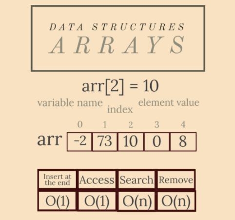

数组是最简单也是最常见的数据结构。它们的特点是可以通过索引（位置）轻松访问元素。

**它们是做什么用的？**

想象一下有一排剧院椅。每把椅子都分配了一个位置（从左到右），因此每个观众都会从他将要坐的椅子上分配一个号码。这是一个数组。将问题扩展到整个剧院（椅子的行和列），您将拥有一个二维数组（矩阵）！

**特性**

- **元素的值按顺序放置，并通过从 0 到数组长度的索引访问；**
- **数组是连续的内存块；**
- **它们通常由相同类型的元素组成（这取决于编程语言）；**
- **元素的访问和添加速度很快；搜索和删除不是在 O(1) 中完成的。**

## 2. 链表（Linked Lists）

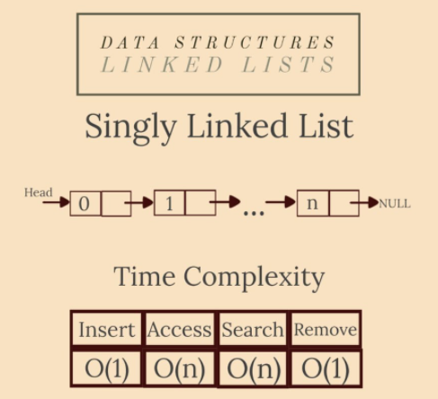

链表是线性数据结构，就像数组一样。链表和数组的主要区别在于链表的元素不存储在连续的内存位置。它由节点组成——实体存储当前元素的值和下一个元素的地址引用。这样，元素通过指针链接。

**它们是做什么用的？**

链表的一个相关应用是浏览器的上一页和下一页的实现。双链表是存储用户搜索显示的页面的完美数据结构。

**特性**

- **它们分为三种类型：单独的、双重的和圆形的；**
- **元素不存储在连续的内存块中；**
- **完美的优秀内存管理（使用指针意味着动态内存使用）；**
- **插入和删除都很快；访问和搜索元素是在线性时间内完成的。**

## 3. 堆栈（Stacks）

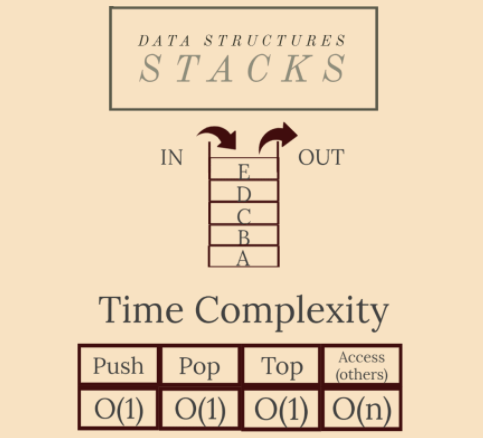

堆栈是一种抽象数据类型，它形式化了受限访问集合的概念。该限制遵循 LIFO（后进先出）规则。因此，添加到堆栈中的最后一个元素是您从中删除的第一个元素。

堆栈可以使用数组或链表来实现。

**它们是做什么用的？**

现实生活中最常见的例子是在食堂中将盘子叠放在一起。位于顶部的板首先被移除。放置在最底部的盘子是在堆栈中保留时间最长的盘子。

堆栈最有用的一种情况是您需要获取给定元素的相反顺序。只需将它们全部推入堆栈，然后弹出它们。

另一个有趣的应用是有效括号问题。给定一串括号，您可以使用堆栈检查它们是否匹配。

**特性**

- **您一次只能访问最后一个元素（顶部的元素）；**
- **一个缺点是，一旦您从顶部弹出元素以访问其他元素，它们的值将从堆栈的内存中丢失；**
- **其他元素的访问是在线性时间内完成的；任何其他操作都在 O(1) 中。**

## 4. 队列（Queues）

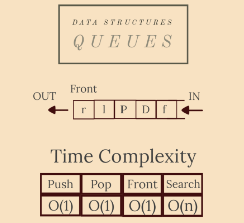

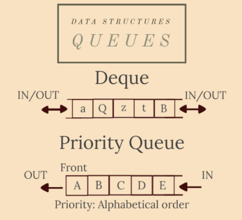

队列是受限访问集合中的另一种数据类型，就像前面讨论的堆栈一样。主要区别在于队列是按照FIFO（先进先出)模型组织的：队列中第一个插入的元素是第一个被移除的元素。队列可以使用固定长度的数组、循环数组或链表来实现。

**它们是做什么用的？**

这种抽象数据类型 (ADT) 的最佳用途当然是模拟现实生活中的队列。例如，在呼叫中心应用程序中，队列用于保存等待从顾问那里获得帮助的客户——这些客户应该按照他们呼叫的顺序获得帮助。

一种特殊且非常重要的队列类型是优先级队列。元素根据与它们关联的“优先级”被引入队列：具有最高优先级的元素首先被引入队列。这个 ADT 在许多图算法（Dijkstra 算法、BFS、Prim 算法、霍夫曼编码 - 更多关于它们的信息）中是必不可少的。它是使用堆实现的。

另一种特殊类型的队列是deque 队列（双关语它的发音是“deck”）。可以从队列的两端插入/删除元素。

**特性**

- **我们只能直接访问引入的“最旧”元素；**
- **搜索元素将从队列的内存中删除所有访问过的元素；**
- **弹出/推送元素或获取队列的前端是在恒定时间内完成的。搜索是线性的。**

## 5. Map 和 哈希表（Hash Table）

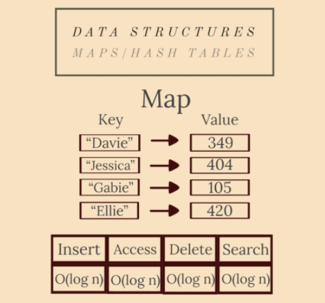

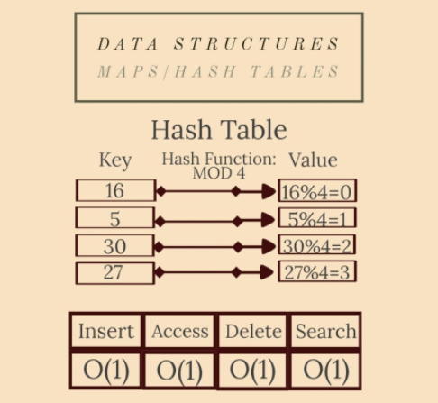

Maps （dictionaries）是包含键集合和值集合的抽象数据类型。每个键都有一个与之关联的值。

哈希表是一种特殊类型的映射。它使用散列函数生成一个散列码，放入一个桶或槽数组：键被散列，结果散列指示值的存储位置。

最常见的散列函数（在众多散列函数中）是模常数函数。例如，如果常量是 6，则键 x 的值是x%6。

理想情况下，散列函数会将每个键分配给一个唯一的桶，但他们的大多数设计都采用了不完善的函数，这可能会导致具有相同生成值的键之间发生冲突。这种碰撞总是以某种方式适应的。

**它们是做什么用的？**

Maps 最著名的应用是语言词典。语言中的每个词都为其指定了定义。它是使用有序映射实现的（其键按字母顺序排列）。

通讯录也是一张Map。每个名字都有一个分配给它的电话号码。

另一个有用的应用是值的标准化。假设我们要为一天中的每一分钟（24 小时 = 1440 分钟）分配一个从 0 到 1439 的索引。哈希函数将为h(x) = x.小时*60+x.分钟。

**特性**

- **键是唯一的（没有重复）；**
- **抗碰撞性：应该很难找到具有相同键的两个不同输入；**
- **原像阻力：给定值 H，应该很难找到键 x，使得h(x)=H；**
- **第二个原像阻力：给定一个键和它的值，应该很难找到另一个具有相同值的键；**

**术语：**

- **“map”：Java、C++；**
- **“dictionary”：Python、JavaScript、.NET；**
- **“associative array"：PHP。**

因为maps 是使用自平衡红黑树实现的（文章后面会解释），所以所有操作都在 O(log n) 内完成；所有哈希表操作都是常量。

## 6. 图表（Graphs）

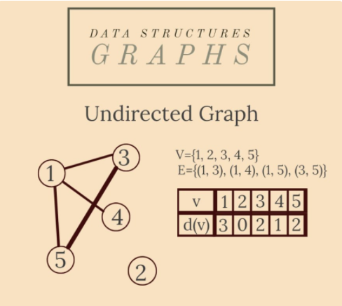

图是表示一对两个集合的非线性数据结构：G={V, E}，其中 V 是顶点（节点）的集合，而 E 是边（箭头）的集合。节点是由边互连的值 - 描述两个节点之间的依赖关系（有时与成本/距离相关联）的线。

图有两种主要类型：有向图和无向图。在无向图中，边(x, y)在两个方向上都可用：(x, y)和(y, x)。在有向图中，边(x, y)称为箭头，方向由其名称中顶点的顺序给出：箭头(x, y)与箭头(y, x) 不同。

**它们是做什么用的？**

图是各种类型网络的基础：社交网络（如 weixin、csdn、weibo），甚至是城市街道网络。社交媒体平台的每个用户都是一个包含他/她的所有个人数据的结构——它代表网络的一个节点。weixin 上的好友关系是无向图中的边（因为它是互惠的），而在 CSDN 或 weibo上，帐户与其关注者/关注帐户之间的关系是有向图中的箭头（非互惠）。

**特性**

图论是一个广阔的领域，但我们将重点介绍一些最知名的概念：

- **无向图中节点的度数是它的关联边数；**
- **有向图中节点的内部/外部度数是指向/来自该节点的箭头的数量；**
- **从节点 x 到节点 y 的链是相邻边的连续，x 是它的左端，y 是它的右边；**
- **一个循环是一个链，其中 x=y；图可以是循环/非循环的；如果 V 的任意两个节点之间存在链，则图是连通的；**
- **可以使用广度优先搜索 (BFS) 或深度优先搜索 (DFS) 遍历和处理图，两者都在 O(|V|+|E|) 中完成，其中 |S| 是集合S 的基数；查看下面的链接，了解图论中的其他基本信息。**

## 7. 树（Trees）

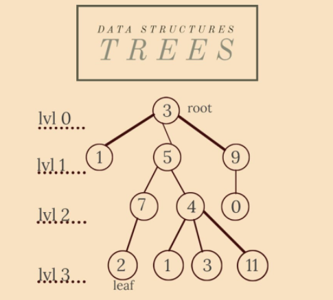

一棵树是一个无向图，在连通性方面最小（如果我们消除一条边，图将不再连接）和在无环方面最大（如果我们添加一条边，图将不再是无环的） . 所以任何无环连通无向图都是一棵树，但为了简单起见，我们将有根树称为树。

根是一个固定节点，它确定树中边的方向，所以这就是一切“开始”的地方。叶子是树的终端节点——这就是一切“结束”的地方。
一个顶点的孩子是它下面的事件顶点。一个顶点可以有多个子节点。一个顶点的父节点是它上面的事件顶点——它是唯一的。

**它们是做什么用的？**

我们在任何需要描绘层次结构的时候都使用树。我们自己的家谱树就是一个完美的例子。你最古老的祖先是树的根。最年轻的一代代表叶子的集合。

树也可以代表你工作的公司中的上下级关系。这样您就可以找出谁是您的上级以及您应该管理谁。

**特性**

- **根没有父级；**
- **叶子没有孩子；**
- **根和节点 x 之间的链的长度表示 x 所在的级别；**
- **一棵树的高度是它的最高层（在我们的例子中是 3）；**
- **最常用的遍历树的方法是 O(|V|+|E|) 中的 DFS，但我们也可以使用 BFS；使用 DFS 在任何图中遍历的节点的顺序形成 DFS 树，指示我们访问节点的时间。**

## 8. 二叉树（Binary Trees）和二叉搜索树（Binary Search Trees）

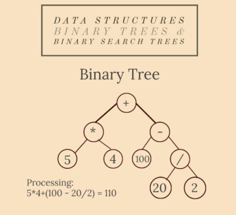

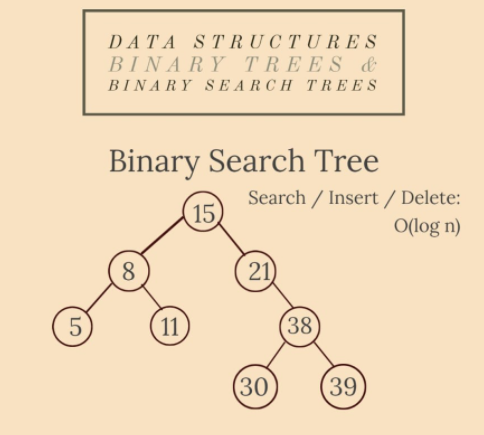

二叉树是一种特殊类型的树：每个顶点最多可以有两个子节点。在严格二叉树中，除了叶子之外，每个节点都有两个孩子。具有 n 层的完整二叉树具有所有2ⁿ-1 个可能的节点。

二叉搜索树是一棵二叉树，其中节点的值属于一个完全有序的集合——任何任意选择的节点的值都大于左子树中的所有值，而小于右子树中的所有值。

**它们是做什么用的？**

BT 的一项重要应用是逻辑表达式的表示和评估。每个表达式都可以分解为变量/常量和运算符。这种表达式书写方法称为逆波兰表示法 (RPN)。这样，它们就可以形成一个二叉树，其中内部节点是运算符，叶子是变量/常量——它被称为抽象语法树（AST）。

BST 经常使用，因为它们可以快速搜索键属性。AVL 树、红黑树、有序集和映射是使用 BST 实现的。

**特性**

BST 有三种类型的 DFS 遍历：

- **先序（根、左、右）；**
- **中序（左、根、右）；**
- **后序（左、右、根）；全部在 O(n) 时间内完成；**
- **中序遍历以升序为我们提供了树中的所有节点；**
- **最左边的节点是 BST 中的最小值，最右边的节点是最大值；**
- **注意 RPN 是 AST 的中序遍历；**
- **BST 具有排序数组的优点，但有对数插入的缺点——它的所有操作都在 O(log n) 时间内完成。**

## 9. AVL树（Adelson-Velsky and Landis Trees ）

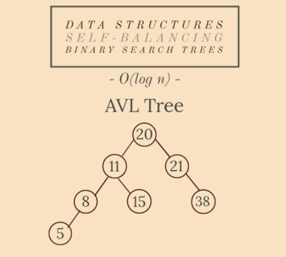

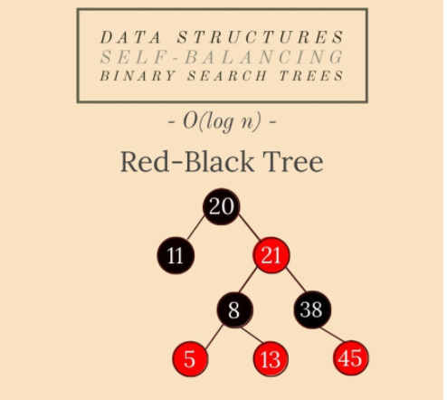

所有这些类型的树都是自平衡二叉搜索树。不同之处在于它们以对数时间平衡高度的方式。

AVL 树在每次插入/删除后都是自平衡的，因为节点的左子树和右子树的高度之间的模块差异最大为 1。 AVL 以其发明者的名字命名：Adelson-Velsky 和 Landis。

在红黑树中，每个节点存储一个额外的代表颜色的位，用于确保每次插入/删除操作后的平衡。

在 Splay 树中，最近访问的节点可以快速再次访问，因此任何操作的摊销时间复杂度仍然是 O(log n)。

**它们是做什么用的？**

AVL 似乎是数据库理论中最好的数据结构。

RBT（红黑树） 用于组织可比较的数据片段，例如文本片段或数字。在 Java 8 版本中，HashMap 是使用 RBT 实现的。计算几何和函数式编程中的数据结构也是用 RBT 构建的。

在 Windows NT 中（在虚拟内存、网络和文件系统代码中），Splay 树用于缓存、内存分配器、垃圾收集器、数据压缩、绳索（替换用于长文本字符串的字符串）。

**特性**

- **ANY自平衡BST中ANY操作的摊销时间复杂度为O(log n)；**
- **在最坏的情况下，AVL 的最大高度是 1.44 \* log2n（为什么？==提示==：考虑所有级别都已满的 AVL 的情况，除了最后一个只有一个元素）；**
- **AVLs 在实践中搜索元素是最快的，但是为了自平衡而旋转子树的成本很高；**
- **同时，由于没有旋转，RBT 提供了更快的插入和删除；**
- **展开树不需要存储任何簿记数据。**

## 10.堆（Heaps）

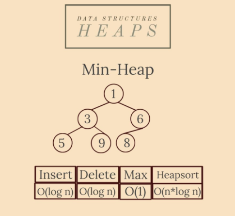

最小堆是一棵二叉树，其中每个节点的值都大于或等于其父节点的值：`val[par[x]] <= val[x]`，具有堆的 xa 节点，其中`val[ x]`是它的值，par[x] 是它的父级。

还有一个实现相反关系的最大堆。

二叉堆是一棵完整的二叉树（它的所有层都被填充，除了最后一层）。

**它们是做什么用的？**

正如我们几天前讨论过的，优先队列可以使用二叉堆有效地实现，因为它支持 O(log n) 时间内的 `insert()`、`delete()`、`extractMax()` 和 `reduceKey()` 操作。这样，堆在图算法中也是必不可少的（因为优先级队列）。

任何时候您需要快速访问最大/最小项目，堆都是最好的选择。

堆也是堆排序算法的基础。

**特性**

- **它总是平衡的：无论何时我们在结构中删除/插入一个元素，我们只需要“筛选”/“渗透”它直到它处于正确的位置；**
- **节点k > 1的父节点是[k/2]（其中 [x] 是 x 的整数部分），其子节点是2\*k和2\*k+1；**
- **设置优先级队列的替代方案，ordered_map（在 C++ 中）或任何其他可以轻松允许访问最小/最大元素的有序结构；**
- **根优先，因此其访问的时间复杂度为O(1)，插入/删除在O(log n)中完成；创建一个堆是在 O(n) 中完成的；O(n\*log n)中的堆排序。**

## 11.字典树（Tries）

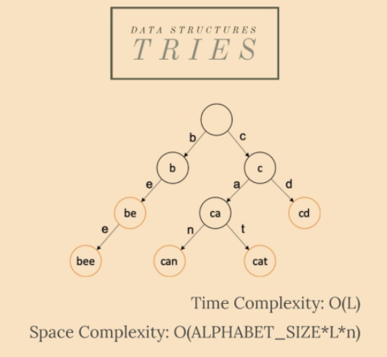

trie 是一种高效的信息检索数据结构。也称为前缀树，它是一种搜索树，允许以 O(L) 时间复杂度插入和搜索，其中 L 是键的长度。

如果我们将密钥存储在一个平衡良好的 BST 中，它将需要与 L * log n 成正比的时间，其中 n 是树中的密钥数量。这样，与 BST 相比，trie 是一种更快的数据结构（使用 O(L)），但代价是 trie 存储要求。

**它们是做什么用的？**

树主要用于存储字符串及其值。它最酷的应用程序之一是在 Google 搜索栏中键入自动完成和自动建议。特里是最好的选择，因为它是最快的选择：如果我们不使用特里，更快的搜索比节省的存储更有价值。

通过在字典中查找单词或在同一文本中查找该单词的其他实例，也可以使用 trie 来完成键入单词的正字法自动更正。

**特性**

- **它有一个键值关联；键通常是一个单词或它的前缀，但它可以是任何有序列表；**
- **根有一个空字符串作为键；**
- **节点值与其子节点值之间的长度差为 1；这样，根的子节点将存储长度为 1 的值；作为结论，我们可以说来自第 k 层的节点 x 具有长度k 的值；**
- **正如我们所说，插入/搜索操作的时间复杂度是 O(L)，其中 L 是键的长度，这比 BST 的 O(log n) 快得多，但与哈希表相当；**

空间复杂度实际上是一个缺点：`O(ALPHABET_SIZE*L*n)`。

## 12. 段树（Segment Trees）

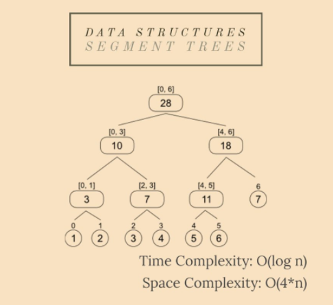

段树是一个完整的二叉树，可以有效地回答查询，同时仍然可以轻松修改其元素。

给定数组中索引 i 上的每个元素代表一个用[i, i]间隔标记的叶子。将其子节点分别标记为[x, y]或[y, z]的节点将具有[x, z]区间作为标签。因此，给定 n 个元素（0-indexed），线段树的根将被标记为[0, n-1]。

**它们是做什么用的？**

它们在可以使用分而治之（我们将要讨论的第一个算法概念）解决的任务中非常有用，并且还可能需要更新其元素。这样，在更新元素时，包含它的任何区间也会被修改，因此复杂度是对数的。例如，n 个给定元素的总和/最大值/最小值是线段树最常见的应用。如果元素更新正在发生，二分搜索也可以使用段树。

**特性**

- **作为二叉树，节点 x 将2\*x和2\*x+1作为子节点，[x/2]作为父节点，其中[x]是x的整数部分；**
- **更新段树中整个范围的一种有效方法称为“延迟传播”，它也是在 O(log n) 中完成的（有关操作的实现，请参见下面的链接）；**
- **它们可以是 k 维的：例如，有 q 个查询来查找一个矩阵的给定子矩阵的总和，我们可以使用二维线段树；**
- **更新元素/范围需要 O(log n) 时间；对查询的回答是恒定的(O(1))；**
- **空间复杂度是线性的，这是一个很大的优势：O(4\*n)。**

## 13. 树状数组（Fenwick Trees）

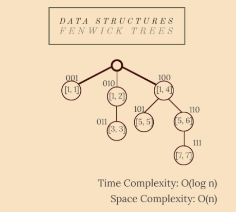

fenwick 树，也称为二叉索引树 (BIT)，是一种也用于高效更新和查询的数据结构。与 Segment Trees 相比，BITs 需要更少的空间并且更容易实现。

**它们是做什么用的？**

BIT 用于计算前缀和——第 i 个位置的元素的前缀和是从第一个位置到第 i 个元素的总和。它们使用数组表示，其中每个索引都以二进制系统表示。例如，索引 10 相当于十进制系统中的索引 2。

**特性**

- **树的构建是最有趣的部分：首先，数组应该是 1-indexed 要找到节点 x 的父节点，您应该将其索引 x 转换为二进制系统并翻转最右边的有效位；ex.节点 6 的父节点是 4；**

```java
6 = 1*2²+1*2¹+0*2⁰ => 1"1"0 (flip) 
=> 100 = 1*2²+0*2¹+0*2⁰ = 4;
```

- **最后，ANDing 元素，每个节点都应该包含一个可以添加到前缀和的间隔；**
- **更新的时间复杂度仍然是 O(log n)，查询的时间复杂度仍然是 O(1)，但空间复杂度与线段树的 O(4\*n) 相比是一个更大的优势：O(n)。**

## 14. 并查集（Disjoint Set Union）

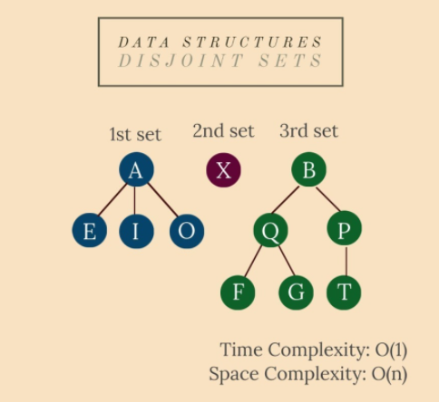

我们有 n 个元素，每个元素代表一个单独的集合。并查集 (DSU) 允许我们做两个操作：

1.UNION — 组合任意两个集合（或者统一两个不同元素的集合，如果它们不是来自同一个集合）；
2.FIND — 查找元素来自的集合。

**它们是做什么用的？**

并查集（DSU） 在图论中非常重要。您可以检查两个顶点是否来自同一个连接组件，或者甚至可以统一两个连接组件。

让我们以城市和城镇为例。由于人口和经济增长的邻近城市正在扩张，它们可以轻松创建大都市。因此，两个城市合并在一起，他们的居民住在同一个大都市。我们还可以通过调用 FIND 函数来检查一个人居住在哪个城市。

**特性**

- **它们用树表示；一旦两组组合在一起，两个根中的一个成为主根，另一个根的父代是另一棵树的叶子之一；**
- **一种实用的优化是通过高度压缩树木；这样，联合由最大的树组成，以轻松更新它们的两个数据（参见下面的实现）；**
- **所有操作都在 O(1) 时间内完成。**

## 15. 最小生成树（Minimum Spanning Trees）

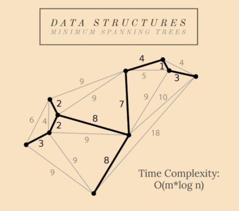

给定一个连通图和无向图，该图的生成树是一个子图，它是一棵树并将所有节点连接在一起。单个图可以有许多不同的生成树。加权、连通和无向图的最小生成树 (MST) 是权重（成本）小于或等于其他所有生成树权重的生成树。生成树的权重是赋予生成树每条边的权重之和。

**它们是做什么用的？**

最小生成树（MST ）问题是一个优化问题，一个最小成本问题。有了路线网，我们可以认为影响n个城市之间建立国道的因素之一是相邻两个城市之间的最小距离。

国家路线就是这样，由道路网络图的 MST 表示。

**特性**

作为一棵树，具有 `n` 个顶点的图的 MST 具有 `n-1` 条边；可以使用以下方法解决：

- **Prim 算法 — 密集图的最佳选择（具有 `n` 个节点且边数接近`n(n-1)/2)`的图）；**
- **Kruskal 算法——主要使用；它是一种基于不相交集联合的贪心算法（我们后面也将讨论它）；**
- **构建它的时间复杂度对于 Kruskal 来说是 O(n log n) 或 O(n log m)（这取决于图），对于 Prim 来说是 O(n²)。**

# 二、算法

## 1.分治算法（Divide and Conquer）

分而治之（DAC）本身并不是一个特定的算法，而是在深入研究其他主题之前需要了解的重要算法类别。它用于解决可以划分为与原始问题相似但规模较小的子问题的问题。然后 DAC 递归地求解它们，最后合并结果以找到问题的解决方案。

它分为三个阶段：

- **划分——将问题分解为子问题；**
- **用递归解决子问题；**
- **合并——子问题的结果到最终解决方案中。**

**它是干什么用的？**

分治算法（DAC） 的一种实际应用是使用多个处理器进行并行编程，因此子问题在不同的机器上执行。

DAC 是许多算法的基础，例如快速排序、合并排序、二分搜索或快速乘法算法。

**特性**

- **每个 DAC 问题都可以写成一个递推关系；因此，必须找到停止递归的基本情况；**
- **它的复杂度是`T(n)=D(n)+C(n)+M(n)`，这意味着每个阶段都有不同的复杂度，具体取决于问题。**

## 2. 排序算法（Sorting Algorithms）

排序算法用于根据元素上的比较运算符重新排列给定元素（来自数组或列表）。当我们提到一个排序数组时，我们通常会想到升序（比较运算符是“<”）。排序有多种类型，具有不同的时间和空间复杂度。其中一些是基于比较的，有些则不是。以下是最流行/最有效的排序方法：

### 冒泡排序（Bubble Sort）

冒泡排序是最简单的排序算法之一。它基于相邻元素之间的重复交换（如果它们的顺序错误）。它是稳定的，它的时间复杂度是 O(n²) 并且它需要 O(1) 辅助空间。

### 计数排序（Counting Sort）

计数排序不是基于比较的排序。它基本上是使用每个元素的频率（一种散列），确定最小值和最大值，然后在它们之间迭代以根据其频率放置每个元素。它在 O(n) 中完成，空间与数据范围成正比。如果输入范围不明显大于元素数量，则它是有效的。

### 快速排序（Quick Sort）

快速排序是分而治之的一个应用。它基于选择一个元素作为枢轴（第一个、最后一个或中间值），然后交换元素以将枢轴放置在所有小于它的元素和所有大于它的元素之间。它没有额外的空间和 O(n*log n) 时间复杂度——基于比较的方法的最佳复杂度。

### 归并排序（Merge Sort）

归并排序也是一个分而治之的应用程序。它将数组分成两半，对每一半进行排序，然后合并它们。它的时间复杂度也是 O(n*log n)，所以它也像 Quick Sort 一样超快，但不幸的是它需要 O(n) 额外空间来同时存储两个子数组，最后合并它们。

### 基数排序（Radix Sort）

基数排序使用计数排序作为子程序，因此它不是基于比较的算法。我们怎么知道CS是不够的？假设我们必须对[1, n²] 中的元素进行排序。使用 CS，我们需要 O(n²)。我们需要一个线性算法——O(n+k)，其中元素在[1, k]范围内。它从最不重要的一个（单位）开始，到最重要的（十、百等）对元素进行逐位排序。额外空间（来自 CS）：O(n)。

## 3. 搜索算法（Searching Algorithms）

搜索算法旨在检查数据结构中元素的存在，甚至返回它。有几种搜索方法，但这里是最受欢迎的两种：

### 线性搜索（Linear Search）

该算法的方法非常简单：您从数据结构的第一个索引开始搜索您的值。您将它们一一比较，直到您的值和当前元素相等。如果该特定值不在 DS 中，则返回 -1。

时间复杂度：`O(n)`

### 二分查找（Binary Search）

BS 是一种基于分而治之的高效搜索算法。不幸的是，它只适用于排序的数据结构。作为一种 DAC 方法，您连续将 DS 分成两半，并将搜索中的值与中间元素的值进行比较。如果它们相等，则搜索结束。无论哪种方式，如果您的值大于/小于它，搜索应该继续在右/左半部分。

时间复杂度：`O(log n)`

## 4. 埃氏筛法（Sieve of Eratosthenes）

给定一个整数 n，打印所有小于或等于 n 的素数。
Eratosthenes 筛法是解决这个问题的最有效的算法之一，它完美地适用于小于10.000.000 的n 。

该方法使用频率列表/映射来标记[0, n]范围内每个数字的素数：如果 x 是素数，则ok[x]=0，否则ok[x]=1。

我们开始从列表中选择每个素数，并用 1 标记列表中的倍数——这样，我们选择未标记的 (0) 数。最后，我们可以在 O(1) 中轻松回答任意数量的查询。

经典算法在许多应用中都是必不可少的，但我们可以进行一些优化。首先，我们很容易注意到 2 是唯一的偶素数，因此我们可以单独检查它的倍数，然后在范围内迭代以找到从 2 到 2 的素数。其次，很明显，对于数字 x，我们之前在迭代 2、3 等时已经检查了 2x、3x、4x 等。这样，我们的乘数检查 for 循环每次都可以从 x² 开始。最后，即使这些倍数中有一半是偶数，而且我们也在迭代奇素数，因此我们可以在倍数检查循环中轻松地从 2*x 迭代到 2*x。

空间复杂度：O(n)
时间复杂度：O(n*log(log n)) 用于经典算法，O(n) 用于优化算法。

## 5. 字符串匹配算法（Knuth-Morris-Pratt）

给定长度为 n 的文本和长度为 m 的模式，找出文本中所有出现的模式。

Knuth-Morris-Pratt 算法 (KMP) 是解决模式匹配问题的有效方法。
天真的解决方案基于使用“滑动窗口”，每次设置新的起始索引时，我们都会比较字符与字符，从文本的索引 0 开始到索引 nm。这样，时间复杂度是 O(m*(n-m+1))~O(n*m)。

KMP 是对朴素解决方案的优化：它在 O(n) 中完成，并且当模式具有许多重复的子模式时效果最佳。因此，它也使用滑动窗口，但不是将所有字符与子字符串进行比较，而是不断寻找当前子模式的最长后缀，这也是它的前缀。换句话说，每当我们在某些匹配后检测到不匹配时，我们就已经知道下一个窗口文本中的某些字符。因此，再次匹配它们是没有用的，因此我们重新开始匹配文本中具有该前缀后的字符的相同字符。我们怎么知道我们应该跳过多少个字符？好吧，我们应该构建一个预处理数组，告诉我们应该跳过多少个字符。

## 6.贪婪算法（Greedy）

Greedy 方法多用于需要优化且局部最优解导致全局最优解的问题。

也就是说，当使用 Greedy 时，每一步的最优解都会导致整体最优解。然而，在大多数情况下，我们在一个步骤中做出的决定会影响下一步的决定列表。在这种情况下，必须用数学方法证明算法。Greedy 也会在一些数学问题上产生很好的解决方案，但不是全部（可能无法保证最佳解决方案）！

贪心算法通常有五个组成部分：

- **候选集——从中创建解决方案；**
- **选择函数——选择最佳候选人；**
- **可行性函数——可以确定候选人是否能够为解决方案做出贡献；**
- **一个目标函数——将候选人分配给（部分）解决方案；**
- **一个解决方案函数——从部分解决方案构建解决方案。**

**分数背包问题**

给定n个物品的重量和价值，我们需要将这些物品放入容量为W的背包中，以获得背包中的最大总价值（允许取件物品：一件物品的价值与其重量成正比）。

贪心方法的基本思想是根据它们的价值/重量比对所有项目进行排序。然后，我们可以添加尽可能多的整个项目。当我们发现一件比背包中剩余重量 (w1) 重 (w2) 的物品时，我们将对其进行分割：仅取出w2-w1以最大化我们的利润。保证这个贪心的解决方案是正确的。

## 7. 动态规划（Dynamic Programming）

动态规划 (DP) 是一种类似于分而治之的方法。它还将问题分解为类似的子问题，但它们实际上是重叠和相互依赖的——它们不是独立解决的。

每个子问题的结果都可以在以后随时使用，它是使用记忆（预先计算）构建的。DP 主要用于（时间和空间）优化，它基于寻找循环。

DP 应用包括斐波那契数列、河内塔、Roy-Floyd-Warshall、Dijkstra 等。 下面我们将讨论 0-1 背包问题的 DP 解决方案。

### 0–1 背包问题

给定n个物品的重量和价值，我们需要将这些物品放入容量为W的背包中，以获得背包中的最大总值（不允许像贪婪解决方案中的那样分割物品）。
0-1 属性是由我们应该选择整个项目或根本不选择它的事实给出的。
我们构建了一个 DP 结构作为矩阵`dp[i][cw]`存储我们通过选择总权重为 cw 的 i 个对象可以获得的最大利润。很容易注意到我们应该首先用`v[i]`初始化`dp[1][w[i] ]`，其中`w[i]`是第 i 个对象的权重，`v[i]` 是它的值。
复现如下：

```javascript
dp[i][cw] = max(dp[i-1][cw], dp[i-1][cw-w[i]]+v[i])
```

我们稍微分析一下。

`dp[i-1][cw]`描述了我们没有在背包中添加当前物品的情况。`dp[i-1][cw-w[i]]+v[i]`就是我们添加item的情况。话虽如此，`dp[i-1][cw-w[i]]`是采用 `i-1` 个元素的最大利润：所以它们的重量是当前重量，没有我们的物品重量。最后，我们将项目的值添加到它。

答案存入`dp[n][W]`. 通过一个简单的观察进行优化：在循环中，当前行仅受前一行的影响。因此，将DP结构存储到矩阵中是不必要的，因此我们应该选择一个空间复杂度更好的数组：O(n)。时间复杂度：O(n*W)。

## 8. 最长公共子序列（Longest Common Subsequence）

给定两个序列，找出它们中存在的最长子序列的长度。子序列是以相同的相对顺序出现的序列，但不一定是连续的。例如，“`bcd`”、“`abdg`”、“`c`”都是“`abcdefg`”的子序列。

这是动态规划的另一个应用。LCS 算法使用 DP 来解决上述问题。

实际的子问题是要分别从序列 A 中的索引 i 开始，分别从序列 B 中的索引 j 中找到最长公共子序列。

接下来，我们将构建 DP 结构`lcs[ ][ ]`（矩阵），其中`lcs[i][j]`是从 A 中的索引 i 开始，分别是 B 中的索引 j 的公共子序列的最大长度。我们将以自顶向下的方式构建它。显然，解决方案存储在`lcs[n][m]` 中，其中 n 是 A 的长度，m 是 B 的长度。

递推关系非常简单直观。为简单起见，我们将考虑两个序列都是 1 索引的。首先，我们将初始化`lcs[i][0]` , `1<=i<=n`和`lcs[0][j]` , `1<=j<=m` , 0, 作为基本情况（没有从 0 开始的子序列）。然后，我们将考虑两种主要情况：如果A[i]等于B[j]，则`lcs[i][j] = lcs[i-1][j-1]+1`（比之前的 LCS 多一个相同的字符）。否则，它将是`lcs[i-1][j]`（如果不考虑`A[i]`）和`lcs[i][j-1]`（如果不考虑`B[j]`）之间的最大值）。

时间复杂度：`O(n*m)`
附加空间：`O(n*m)`

## 9. 最长递增子序列（Longest Increasing Subsequence）

给定一个包含 n 个元素的序列 A，找到最长子序列的长度，使其所有元素按递增顺序排序。子序列是以相同的相对顺序出现的序列，但不一定是连续的。例如，“`bcd`”、“`abdg`”、“`c`”是“`abcdefg`”的子序列。

LIS 是另一个可以使用动态规划解决的经典问题。

使用数组l[ ]作为 DP 结构来寻找递增子序列的最大长度，其中l[i]是包含A[i]的递增子序列的最大长度，其元素来自`[A[i] ], ..., A[n]]` 子序列。`l[i]`为 1，如果`A[i]`之后的所有元素比它小。否则，在 `A[i]` 之后大于它的所有元素之间的最大值为 1+。显然，`l[n]=1`，其中 n 是 A 的长度。 实现是自底向上的（从末尾开始）。

在搜索当前元素之后的所有元素之间的最大值时出现了一个优化问题。我们能做的最好的事情是二分搜索最大元素。

为了找到现在已知的最大长度的子序列，我们只需要使用一个额外的数组`ind[]`，它存储每个最大值的索引。

时间复杂度：`O(n*log n)`
附加空间：`O(n)`

## 10.凸包算法（Convex Hull）

给定同一平面中的一组 n 个点，找到包含所有给定点（位于多边形内部或其边上）的最小面积凸多边形。这种多边形称为凸包。凸包问题是一个经典的几何，在现实生活中有很多应用。例如，碰撞避免：如果汽车的凸包避免碰撞，那么汽车也能避免碰撞。路径的计算是使用汽车的凸表示完成的。形状分析也是在凸包的帮助下完成的。这样，图像处理很容易通过匹配模型的凸缺陷树来完成。

有一些算法用于寻找凸包，如 Jarvis 算法、Graham 扫描等。今天我们将讨论 Graham 扫描和一些有用的优化。

格雷厄姆扫描按极角对点进行排序——由某个点和其他选定点确定的线的斜率。然后用一个栈来存储当前时刻的凸包。当一个点 x 被压入堆栈时，其他点会被弹出堆栈，直到 x 与最后两个点所确定的线形成小于 180° 的角度。最后，引入堆栈的最后一个点关闭多边形。由于排序，这种方法的时间复杂度为 O(n*log n)。但是，这种方法在计算斜率时会产生精度误差。

一种改进的解决方案具有相同的时间复杂度，但误差较小，按坐标（x，然后是 y）对点进行排序。然后我们考虑由最左边和最右边的点形成的线，并将问题分为两个子问题。最后，我们在这条线的每一边找到了凸包。所有给定点的凸包是两个包的重聚。

## 11. 图遍历（Graph Traversals）

遍历图的问题是指以特定顺序访问所有节点，通常沿途计算其他有用信息。

### 广度优先搜索（Breadth-First Search）

广度优先搜索 (BFS) 算法是确定图是否连通的最常用方法之一——或者换句话说，查找 BFS 源节点的连通分量。

BFS 还用于计算源节点和所有其他节点之间的最短距离。BFS 的另一个版本是 Lee 算法，用于计算网格中两个单元格之间的最短路径。

该算法首先访问源节点，然后访问将被推入队列的邻居。队列中的第一个元素被弹出。我们将访问它的所有邻居，并将之前未访问的邻居推入队列。重复该过程直到队列为空。当队列为空时，表示所有可达顶点都已访问完毕，算法结束。

### 深度优先搜索（Depth-First Search）

深度优先搜索 (DFS) 算法是另一种常见的遍历方法。在检查图形的连通性时，它实际上是最好的选择。

首先，我们访问根节点并将其压入堆栈。虽然堆栈不为空，但我们检查顶部的节点。如果该节点有未访问的邻居，则选择其中一个并将其压入堆栈。否则，如果它的所有邻居都被访问过，我们就会弹出这个节点。当堆栈变空时，算法结束。

经过这样的遍历，就形成了一个DFS树。DFS 树有很多应用；最常见的一种是存储每个节点的“开始”和“结束”时间——它进入堆栈的时刻，分别是它从堆栈中弹出的时刻。

## 12. 弗洛依德算法（Floyd-Warshall）

Floyd-Warshall / Roy-Floyd 算法解决了所有对最短路径问题：找到给定边加权有向图中每对顶点之间的最短距离。

FW 是一个动态规划应用程序。DP 结构（矩阵）`dist[ ][ ]`用输入图矩阵初始化。然后我们将每个顶点视为其他两个节点之间的中间体。最短路径在每两对节点之间更新，任何节点 k 作为中间顶点。如果 k 是 i 和 j 之间排序路径中的中间值，则`dist[i][j]`成为`dist[i][k]+dist[k][j]`和`dist[i][j]`之间的最大值。

时间复杂度：`O(n³)`
空间复杂度：`O(n²)`

## 13. Dijkstra 算法和 Bellman-Ford 算法

### 迪杰斯特拉（Dijkstra） 算法

给定一个图和图中的一个源顶点，找出从源到给定图中所有顶点的最短路径。

Dijkstra 算法用于在加权图中找到这样的路径，其中所有的权重都是正的。

Dijkstra 是一种贪心算法，它使用以源节点为根的最短路径树（SPT）。SPT 是一种自平衡二叉树，但该算法可以使用堆（或优先级队列）来实现。我们将讨论堆解决方案，因为它的时间复杂度是 O(|E|*log |V|)。这个想法是使用图形的邻接列表表示。这样，节点将使用 BFS （广度优先搜索）在 O(|V|+|E|) 时间内遍历。

所有顶点都用 BFS 遍历，那些最短距离尚未最终确定的顶点被存储到最小堆（优先队列）中。

创建最小堆并将每个节点连同它们的距离值一起推入其中。然后，源成为距离为 0 的堆的根。其他节点将无限分配为距离。当堆不为空时，我们提取最小距离值节点 x。对于与 x 相邻的每个顶点 y，我们检查 y 是否在最小堆中。在这种情况下，如果距离值大于 (x, y) 的权重加上 x 的距离值，那么我们更新 y 的距离值。

### 贝尔曼-福特（Bellman-Ford）算法

正如我们之前所说，Dijkstra 仅适用于正加权图。贝尔曼解决了这个问题。给定一个加权图，我们可以检查它是否包含负循环。如果没有，那么我们还可以找到从我们的源到其他源的最小距离（可能为负权重）。

Bellman-Ford 非常适合分布式系统，尽管它的时间复杂度是 O(|V| |E|)。

我们初始化一个 dist[] 就像在 Dijkstra 中一样。对于 *|V|-1次，对于每个(x, y)边，如果dist[y] > dist[x] + (x, y) 的权重，那么我们用它更新dist[y]。

我们重复最后一步以可能找到负循环。这个想法是，如果没有负循环，最后一步保证最小距离。如果有任何节点在当前步骤中的距离比上一步中的距离短，则检测到负循环。

## 14.克鲁斯卡尔算法（Kruskal’s Algorithm）

我们之前已经讨论过什么是最小生成树。

有两种算法可以找到图的 MST：Prim（适用于密集图）和 Kruskal（适用于大多数图）。现在我们将讨论 Kruskal 算法。

Kruskal 开发了一种贪心算法来寻找 MST。它在稀有图上很有效，因为它的时间复杂度是 `O(|E|*log |V|)`。

该算法的方法如下：我们按权重的递增顺序对所有边进行排序。然后，选取最小的边。如果它不与当前 MST 形成循环，我们将其包括在内。否则，丢弃它。重复最后一步，直到 MST 中有 `|V|-1` 条边。

将边包含到 MST 中是使用 `Disjoint-Set-Union` 完成的，这也在前面讨论过。

## 15. 拓扑排序（Topological Sorting）

有向无环图 (DAG) 只是一个不包含循环的有向图。

DAG 中的拓扑排序是顶点的线性排序，使得对于每个拱形(x, y)，节点 x 出现在节点 y 之前。

显然，拓扑排序中的第一个顶点是一个入度为 0 的顶点（没有拱形指向它）。

另一个特殊属性是 DAG 没有唯一的拓扑排序。

BFS （广度优先搜索）实现遵循此例程：找到一个入度为 0 的节点并将第一个推入排序。该顶点已从图中删除。由于新图也是一个 DAG，我们可以重复这个过程。

在 DFS 期间的任何时候，节点都可以属于以下三个类别之一：

- **我们完成访问的节点（从堆栈中弹出）；**
- **当前在堆栈上的节点；**
- **尚未发现的节点。**

如果在 DAG 中的 DFS 期间，节点 x 具有到节点 y 的输出边，则 y 属于第一类或第三类。如果 y 在堆栈上，则(x, y)将结束一个循环，这与 DAG 定义相矛盾。

这个属性实际上告诉我们一个顶点在它的所有传出邻居都被弹出后从堆栈中弹出。因此，要对图进行拓扑排序，我们需要跟踪弹出顶点的逆序列表。

哇，你已经到读了文章的结尾。感谢您的阅览！文章篇幅较长，如果有些出错的地方还请大家批评指正，可在评论区留言或者私信我。

【版权声明】本文为华为云社区用户原创内容，转载时必须标注文章的来源（华为云社区），文章链接，文章作者等基本信息，否则作者和本社区有权追究责任。如果您发现本社区中有涉嫌抄袭的内容，欢迎发送邮件至：[cloudbbs@huaweicloud.com](mailto:cloudbbs@huaweicloud.com)进行举报，并提供相关证据，一经查实，本社区将立刻删除涉嫌侵权内容。