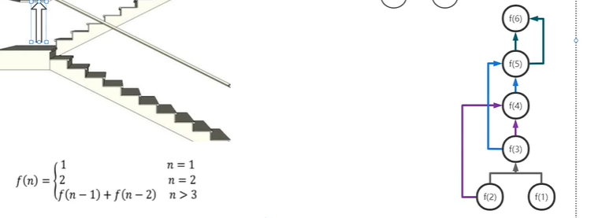
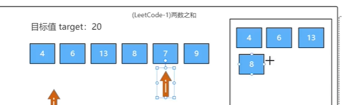

# 立扣刷题的题解方法记录

参考 和 推荐 的教程：

- [华为算法大佬耗时200小时录制：Leetcode刷题100道，足以吊打字节面试官！_哔哩哔哩_bilibili](https://www.bilibili.com/video/BV1eg411w7gn)。
- [LeetCode 最热门 100 题_哔哩哔哩_bilibili](https://www.bilibili.com/video/BV1Pq4y1j78o)。
- [代码随想录 (programmercarl.com)](https://programmercarl.com/)。
- .etc

题解：

- [begeekmyfriend/leetcode: LeetCode in pure C (github.com)](https://github.com/begeekmyfriend/leetcode)。

基本解法/惯用思路：

- 对于陌生问题首先尝试暴力解法，再启发启发找找改进的地方，减低时间和空间复杂度。
- 双指针法：同向移动固定间距双指针（固定窗口）；相向移动双指针（一个从开头开始，一个从结尾开始）；快慢指针（一般一个每次移动两格，一个移动一格）。
- 滑动窗口：用一个 for 变窗口末端来遍历，在其内用 一个 while 依次判断 末端前面、从头开始 所有数据点。

一些语言提供的可用的基本数据结构：

- C++：串（string）、向量（vector）、数组（array）、栈（stack）、哈希表（hash/map）。
- java / python 等等，都对应提供。

------

## LeetCode 70 爬楼梯、剑指 Offer 10 斐波那契数列

递归实现，或循环实现（首先定 f(1) 与 f(2)，然后循环，f(n) 为 其 pre 值 和 prepre 值 相加）。

## LeetCode 1 两数之和

数组中找两个数之和为目标值，返回两个数的下标。

暴力解法：两个 for 循环 遍历 所有两个数的组合，判断 和 为 目标值 就返回。

哈希表法/一次遍历，遍历过的值存储起来：一次 for 循环 遍历 数组所有值，每次经过一个数就从 哈希表/存储池子 里面找 当前值与目标值还差的值 存不存在，如果不存在就把当前值放 哈希表/存储池子 里面。如下图，只用一个 j 遍历一遍即可。

## LeetCode 链表移动

## 数组移动

暴力方法：

如果是右移动一次，就是从后往前遍历一次，先将最后一个放入一个临时变量，然后倒数第2个往倒数第1个放，以此类推，直到第1个往第2个放，然后再把临时变量往第1个放，算法时间复杂度为数组长度加移动次数

双数组法：

在给定的数组的情况下，再申请空间建立一个数组，假如一个长度为5的数组要往右移动两次，那么将第1个数组从第1个位置开始逐个复制到第2个数组，复制数组长度减去移动次数数，即3次，然后再将第1个数组的第3位，开始逐个复制到第2个数组的开头。对于移动次数大于数组长度的情况，通过移动次数对数组长度求余运算来得到移动次数

链表法：

将这个数组的元素逐个构造到一个链表中，然后就是普通的移动链表的方法，可以参考力扣这个题，然后再从链表恢复到数组

## LeetCode 141 和 142 环形链表 I 和 II

判断一个单向链表有没有环，和返回这个环的起始位置。

固定解法：快慢指针（一个每次移动2格，一个每次移动1格），都从链表头出发，如果相遇则证明有环（如果有环，则快的跑两倍于慢所跑的路径就会遇到慢的）；在相遇之后，将慢指针移动到链表头，快指针在相遇的位置不要动，二者的移动速度都变为 1，然后再开始移动直到相遇，这时相遇的地方就是环的起始位置。可用简单数学证明。

## LeetCode 160 相交链表

检查给出的两个链表（长度不等）是否相交。

1、暴力法：将第一个链表的每一个节点都与第二个链表中所有节点比较是否相等，有相等则有 交叉/相遇，两个 for 循环，时间复杂度 O(m + n)。

2、哈希表法：先遍历一个链表，将该链表每个节点均存到 哈希表内，然后遍历第二个链表，每一个节点与 哈希表里面存的节点作比较，若有一致的则有交叉，时间复杂度小了一点但是空间复杂度 O(n)，比较高。主要就是用 哈希表 查询数据的时间复杂度 为 O(1) 这个特性，但是空间复杂度飙升。

3、特别的双指针：两个指针分别指链表A和链表B的头，然后均每次移动1格，若任一个指针遇到 NULL 则改变指向另外链表的头再继续移动，两个指针二者相等的节点即交叉开始的第一个节点。简单数学可证明。

4、先求得两个链表的长度，然后两个指针分别指向 长的哪一个从 二者长度只差 的节点开始 和 短的那个从头开始，均每次移动1格，开始移动，相遇的节点就是交叉开始的节点。

方法 3 和 4 时间和空间复杂度 类似。

## LeetCode206 反转链表

## LeetCode 876 和 剑指 Offer 22 求链表中间节点 和 倒数第 k 个节点

都是用双指针，都是一次遍历，时间复杂度 O(n)，空间复杂度 O(1)。

求链表中间节点：快慢指针，快指针每次移动2格，慢指针每次移动1格，两个指针都从头节点开始走，直到 快指针 移动到 NULL 或者 快指针的下一个节点为 NULL 为止，此时慢指针所在位置就是中间节点，如果链表节点个数为偶数，则慢指针所有节点为中间节点的第二个。因为快指针走完之后，慢指针走的路程为快指针的一半，就位于中间。

求链表倒数第 k 个节点：双指针，一开始都在头节点，并且移动速度都是每次移动1格，首先让一个指针先走 k 次，然后两个指针同时走，直到先走的那个走到了 NULL 的地方则停止，此时另一个指针所在位置就是 倒数 第 k 个节点。

## LeetCode 234 回文链表

如果是回文数组，可以用双指针，分别指向头和尾，每次都移动一格，相向而行，如果两个指针指向的数据不一致则判断该数组内的值不是回文。那么对于回文链表，则先遍历一遍链表将链表内的数据存放到一个数组内，然后用上述的方法确定是否回文。时间和空间复杂度都是 O(n)。

时间复杂度是 O(n) 且 空间复杂度为 O(1) 的解法：将链表的后半部分反转，然后双指针逐个比较。确定开始反转的开始位置用上面“求链表中间节点”中的方法，即快慢指针，反转链表即常规方法。

## LeetCode 232 用栈实现队列

栈是后进先出（LIFO），队列为先进先出（FIFO），二者如果输入相同数据且顺序一致，那么栈与队列的输出顺序正好相反，栈输出时候可以再压入另一个栈再输出，用两个栈将顺序反两次就变正了，就与队列一致了。

数据都是一个一个进、一个一个出的，准备两个栈，外面数据输入的时候，都压入（push）第一个栈，要取出数据的时候，先将第一个栈中所有数据都挨个弹出（pop）和压入第二个栈，然后再从第二个栈弹出数据。

## LeetCode 394 字符串解码

[LeetCode 394 字符串解码 讲解 哔哩哔哩_bilibili](https://www.bilibili.com/video/BV1eg411w7gn?p=22)，用栈和递归（或循环）实现。